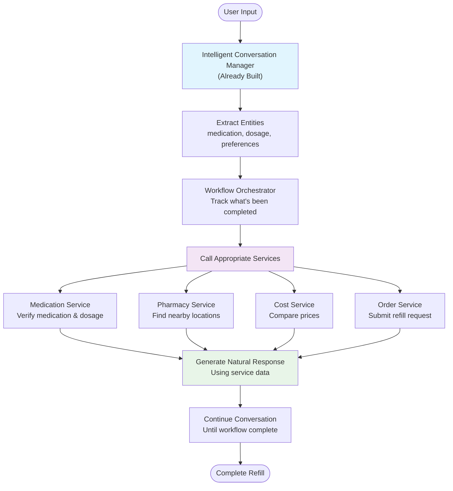

# Pharmacy Refill AI Assistant - Project Implementation Guide

## Project Overview
Building an AI-powered pharmacy refill assistant for Qventus interview challenge. The system demonstrates conversational AI, tool integration, RAG implementation, and mathematical optimization in a healthcare context.

### Position Context
- **Role**: Forward-Deployed AI Solution Architect at Qventus
- **Goal**: Demonstrate ability to architect modular, scalable AI assistants for healthcare operations
- **Time Limit**: 4-6 hours (don't over-engineer)

## Technical Stack
- **Framework**: LangChain + LangGraph (for state management and graph-based conversation flow)
- **LLM**: Any (OpenAI, or local LLM)
- **Frontend**: Streamlit (Python-based, quick to implement)
- **Vector Store**: FAISS (simple, no infrastructure needed)
- **Embeddings**: OpenAI or HuggingFace embeddings

## Core Architecture

### Tool-Based AI Assistant Approach
This approach demonstrates:
- **Tool Calling**: LLM decides when to call tools for information
- **Real + Mock APIs**: Mix of actual (RxNorm) and simulated (GoodRx) integrations
- **Healthcare Context**: Patient history, drug interactions, cost optimization
- **Scalable Design**: Easy to add new tools without changing core logic

### Key Business Value
- Reduces refill processing time from 15-30 min to 2-3 min
- Natural conversation experience instead of rigid step-by-step forms
- Prevents medication errors through automated safety checks
- Optimizes costs by suggesting alternatives and comparing pharmacies
- Improves patient satisfaction with AI-powered assistance

## Implementation Strategy

### Phase 1: Tool Creation (1.5 hours)
Create tools that the AI assistant can call:
1. **Patient History Tool** → Retrieve medication history, adherence data
2. **RxNorm Tool** → Real API for medication verification
3. **Pharmacy Inventory Tool** → Mock real-time inventory checks
4. **Insurance Tool** → Mock formulary and PA checks
5. **Cost Comparison Tool** → Mock GoodRx-style pricing

### Phase 2: LangChain Integration (1.5 hours)  
Connect tools to existing conversation system:
- Conversation manager calls tools based on user intent
- Tools return data that conversation uses in natural responses
- Simple state tracking to know what's been completed

### Phase 3: Workflow & Demo (1 hour)  
Polish the workflow and prepare for demonstration:
- End-to-end testing of the refill process
- Ensure all tools and services are properly integrated
- Prepare demo scenarios that showcase key features

### Conversation Flow (User Experience)
**Natural conversation that covers all workflow steps:**
1. User: "I need to refill my lisinopril"
2. AI: "I'll help you refill Lisinopril. What dosage are you taking?"
3. User: "10mg, I need a 30-day supply"
4. AI: "Found your medication. I see 3 pharmacies nearby. CVS is closest but Walmart is $10 cheaper. Which would you prefer?"
5. User: "Walmart sounds good"
6. AI: "Perfect! Your Lisinopril 10mg is ready for pickup at Walmart on Main St after 2pm. Confirmation #12345. You saved $10!"

**No rigid steps - conversation adapts to user needs**

## Implementation Components

### 1. Tool Definitions

#### Patient History Tool
```python
# rxflow/tools/patient_history_tool.py
from langchain.tools import Tool
from typing import Dict, List
import json

class PatientHistoryTool:
    """Mock patient medication history database"""
    
    def __init__(self):
        self.patient_data = {
            "12345": {  # Mock patient ID
                "medications": [
                    {
                        "name": "lisinopril",
                        "dosage": "10mg", 
                        "start_date": "2023-01-15",
                        "refills_remaining": 2,
                        "last_filled": "2024-01-05",
                        "adherence_rate": 0.92
                    },
                    {
                        "name": "metformin",
                        "dosage": "500mg",
                        "start_date": "2022-06-20", 
                        "refills_remaining": 0,
                        "last_filled": "2023-12-10",
                        "adherence_rate": 0.88
                    }
                ],
                "allergies": ["penicillin", "sulfa"],
                "conditions": ["hypertension", "type 2 diabetes"]
            }
        }
    
    def get_medication_history(self, patient_id: str, medication_name: str = None) -> Dict:
        """Retrieve patient medication history"""
        patient = self.patient_data.get(patient_id, {})
        medications = patient.get("medications", [])
        
        if medication_name:
            medications = [m for m in medications if medication_name.lower() in m["name"].lower()]
        
        return {
            "patient_id": patient_id,
            "medications": medications,
            "allergies": patient.get("allergies", [])
        }
    
    def check_adherence(self, patient_id: str, medication_name: str) -> Dict:
        """Check medication adherence and refill patterns"""
        history = self.get_medication_history(patient_id, medication_name)
        
        if history["medications"]:
            med = history["medications"][0]
            return {
                "medication": med["name"],
                "adherence_rate": med["adherence_rate"],
                "last_filled": med["last_filled"],
                "refills_remaining": med["refills_remaining"],
                "adherence_status": "good" if med["adherence_rate"] > 0.8 else "needs improvement"
            }
        
        return {"error": "Medication not found in history"}

# Create LangChain tool
patient_history_tool = Tool(
    name="patient_medication_history",
    description="Retrieve patient medication history, adherence data, and allergies. Use when needing patient-specific information.",
    func=lambda query: PatientHistoryTool().get_medication_history("12345", query)
)
```

#### RxNorm Integration Tool
```python
# rxflow/tools/rxnorm_tool.py
import requests
from langchain.tools import Tool
from typing import Dict, Optional
import time

class RxNormTool:
    """Real RxNorm API integration for medication verification"""
    
    BASE_URL = "https://rxnav.nlm.nih.gov/REST"
    
    def search_medication(self, medication_name: str) -> Dict:
        """Search for medication in RxNorm database"""
        try:
            # Real API call to RxNorm
            response = requests.get(
                f"{self.BASE_URL}/drugs.json",
                params={"name": medication_name},
                timeout=5
            )
            
            if response.status_code == 200:
                data = response.json()
                # Parse and return relevant info
                return self._parse_rxnorm_response(data)
            else:
                # Fallback to mock data if API fails
                return self._mock_medication_data(medication_name)
                
        except Exception as e:
            # Always have fallback for demo reliability
            return self._mock_medication_data(medication_name)
    
    def get_interactions(self, rxcui: str) -> Dict:
        """Check drug interactions (simplified)"""
        # For demo, return mock interactions
        return {
            "rxcui": rxcui,
            "interactions": [
                {"severity": "moderate", "drug": "ibuprofen", "effect": "May increase blood pressure"}
            ]
        }
    
    def _parse_rxnorm_response(self, data: Dict) -> Dict:
        """Parse RxNorm API response"""
        # Simplified parsing for demo
        drug_group = data.get("drugGroup", {})
        concept_group = drug_group.get("conceptGroup", [])
        
        medications = []
        for group in concept_group:
            if "conceptProperties" in group:
                for concept in group["conceptProperties"]:
                    medications.append({
                        "rxcui": concept.get("rxcui"),
                        "name": concept.get("name"),
                        "synonym": concept.get("synonym", ""),
                        "tty": concept.get("tty")  # Term type
                    })
        
        return {"medications": medications[:5]}  # Limit results
    
    def _mock_medication_data(self, medication_name: str) -> Dict:
        """Fallback mock data"""
        mock_db = {
            "lisinopril": {
                "rxcui": "29046",
                "generic_name": "lisinopril",
                "brand_names": ["Prinivil", "Zestril"],
                "drug_class": "ACE inhibitor"
            },
            "metformin": {
                "rxcui": "6809", 
                "generic_name": "metformin",
                "brand_names": ["Glucophage"],
                "drug_class": "biguanide"
            }
        }
        
        return {"medication": mock_db.get(medication_name.lower(), {"error": "Not found"})}

# Create LangChain tool
rxnorm_tool = Tool(
    name="rxnorm_medication_lookup",
    description="Look up medication information from RxNorm database. Returns drug details, RxCUI, and classifications.",
    func=lambda query: RxNormTool().search_medication(query)
)
```

#### Mock Premium API Tools
```python
# rxflow/tools/premium_api_tools.py
from langchain.tools import Tool
from typing import Dict, List
import random

class MockGoodRxTool:
    """Simulates GoodRx API for price comparison"""
    
    def get_prices(self, medication: str, dosage: str, quantity: int = 30) -> Dict:
        """Mock GoodRx price lookup"""
        # Simulate API response delay
        base_price = random.uniform(10, 100)
        
        pharmacies = {
            "CVS": base_price * 1.2,
            "Walmart": base_price * 0.4,
            "Walgreens": base_price * 1.1,
            "Costco": base_price * 0.3,
            "RiteAid": base_price * 1.15
        }
        
        return {
            "medication": medication,
            "dosage": dosage,
            "quantity": quantity,
            "prices": pharmacies,
            "lowest_price": min(pharmacies.values()),
            "highest_price": max(pharmacies.values()),
            "savings_potential": max(pharmacies.values()) - min(pharmacies.values())
        }

class MockInsuranceFormularyTool:
    """Simulates insurance formulary checks"""
    
    def check_coverage(self, medication: str, insurance_plan: str = "Default Plan") -> Dict:
        """Mock formulary lookup"""
        # Simulate different coverage tiers
        mock_formulary = {
            "lisinopril": {"tier": 1, "copay": 10, "pa_required": False},
            "metformin": {"tier": 1, "copay": 10, "pa_required": False},
            "eliquis": {"tier": 3, "copay": 75, "pa_required": True},
            "humira": {"tier": 4, "copay": 200, "pa_required": True}
        }
        
        med_lower = medication.lower()
        if med_lower in mock_formulary:
            return {
                "medication": medication,
                "covered": True,
                **mock_formulary[med_lower]
            }
        
        return {
            "medication": medication,
            "covered": False,
            "reason": "Non-formulary medication",
            "alternatives": ["generic equivalent available"]
        }

# Create tools
goodrx_tool = Tool(
    name="goodrx_price_lookup",
    description="Get medication prices from multiple pharmacies. Shows lowest prices and savings opportunities.",
    func=lambda query: MockGoodRxTool().get_prices(query, "10mg")
)

insurance_tool = Tool(
    name="insurance_formulary_check",
    description="Check if medication is covered by insurance, what tier, and if prior authorization is needed.",
    func=lambda query: MockInsuranceFormularyTool().check_coverage(query)
)
```

### 2. Enhanced Conversation Manager with Tools

```python
# rxflow/workflow/conversation_manager.py
from langchain.agents import initialize_agent, AgentType
from langchain.memory import ConversationBufferMemory
from rxflow.tools import patient_history_tool, rxnorm_tool, goodrx_tool, insurance_tool

class ConversationManager:
    def __init__(self, llm):
        self.llm = llm
        self.tools = [
            patient_history_tool,
            rxnorm_tool,
            goodrx_tool,
            insurance_tool
        ]
        
        # Initialize agent with tools
        self.agent = initialize_agent(
            tools=self.tools,
            llm=self.llm,
            agent=AgentType.CONVERSATIONAL_REACT_DESCRIPTION,
            memory=ConversationBufferMemory(memory_key="chat_history"),
            verbose=True,  # For demo - shows tool usage
            agent_kwargs={
                "system_message": """You are a pharmacy assistant helping with medication refills.
                Always check patient history first for safety.
                Verify medications with RxNorm.
                Check insurance coverage before showing prices.
                Be helpful and concise."""
            }
        )
    
    async def handle_refill_request(self, user_input: str) -> str:
        """Process refill request using tools"""
        try:
            # Agent will decide which tools to use
            response = await self.agent.arun(user_input)
            return response
        except Exception as e:
            return f"I encountered an issue: {str(e)}. Let me help you another way..."
```

### 3. Tool Usage Examples

```python
# Example prompts that trigger different tools:

# Triggers patient history tool
"I need to refill my blood pressure medication"
# AI: Let me check your medication history... I see you take lisinopril 10mg with good adherence (92%).

# Triggers RxNorm tool
"Is there a generic for Lipitor?"
# AI: Let me look that up... Yes, the generic for Lipitor is atorvastatin.

# Triggers insurance + pricing tools
"How much will my lisinopril cost?"
# AI: Let me check your insurance... Lisinopril is Tier 1 with $10 copay. Without insurance, Walmart has it for $4.

# Triggers multiple tools
"I haven't refilled my diabetes medication in a while"
# AI: Checking your history... Your last metformin refill was 45 days ago. You have 0 refills remaining. 
#     Your adherence is 88%. Let me check the best price for a new prescription...
```

## Critical Implementation Points

### Must-Have Features (Core Requirements)
1. **✅ Intent Recognition**: Already working with intelligent conversation
2. **✅ Entity Extraction**: Already implemented in conversation manager  
3. **🆕 Backend Services**: Add medication, pharmacy, and cost services
4. **🆕 Workflow Integration**: Connect services to conversation manager
5. **✅ Error Handling**: Already implemented

### Focus Areas for Implementation (3-4 hours)
1. **Service Layer**: Create medication, pharmacy, cost services with mock data
2. **Workflow Orchestrator**: Simple state tracking (not complex LangGraph)
3. **Service Integration**: Update conversation manager to call services
4. **Cost Optimization**: Basic pharmacy price comparison
5. **Demo Scenarios**: 2-3 complete refill workflows

### Out of Scope (Keep it Simple)
- ❌ Complex LangGraph state machines 
- ❌ RAG/Vector databases (not needed for core demo)
- ❌ Real API integrations (use mock data)
- ❌ Advanced safety checking (basic validation only)
- ❌ Multiple escalation paths (focus on happy path)

### Key Differentiators to Highlight
1. **Healthcare Domain Knowledge**: Use proper medical terminology (RxNorm, formulary, PA)
2. **Safety First**: Drug interaction checking before cost optimization
3. **User Consent**: Never change medications without explicit approval
4. **Cost Consciousness**: Show savings achieved
5. **Scalability Design**: Modular nodes easily extended to other workflows

## Testing Scenarios

### Happy Path
```
User: "I need to refill my lisinopril"
Bot: "Is this for Lisinopril 10mg, 30-day supply?"
User: "Yes"
Bot: "Available at CVS (0.5mi) for $15 or Walmart (3mi) for $4. Which do you prefer?"
User: "Walmart"
Bot: "Order submitted. Pickup after 2pm. Confirmation #12345. You saved $11!"
```

### Escalation Path
```
User: "Refill my Eliquis"
Bot: "Eliquis requires prior authorization. Shall I send the request to Dr. Johnson?"
User: "Yes"
Bot: "Request sent with required criteria. You'll be notified within 24-48 hours."
```

### Alternative Path
```
User: "Refill my Lipitor"
Bot: "Lipitor (brand) costs $450. Generic atorvastatin is $15. Would you like to switch?"
User: "Yes, switch to generic"
Bot: "Switched to atorvastatin. Available at CVS for pickup in 30 minutes."
```

## Deliverables Checklist

- [ ] Flow diagram (Mermaid or visual)
- [ ] GitHub repo with clean code structure
- [ ] README with setup instructions
- [ ] Core prototype demonstrating:
  - [ ] Intent recognition
  - [ ] Entity extraction
  - [ ] At least one API integration
  - [ ] Conversation state management
  - [ ] One escalation path
- [ ] 1-2 page document on optimization & scalability
- [ ] Clear documentation of AI assistant usage

## Updated Time Management (4 hours)

### **Phase 1: Tool Development (1.5 hours)**
1. **30 min**: Create patient history tool with mock data
2. **30 min**: Implement RxNorm tool with real API + fallback
3. **30 min**: Create mock premium API tools (GoodRx, Insurance)

### **Phase 2: Integration (1.5 hours)**
4. **45 min**: Integrate tools with LangChain agent
5. **45 min**: Test tool calling and conversation flow

### **Phase 3: Workflow & Polish (1 hour)**
6. **30 min**: Create complete refill scenarios using tools
7. **30 min**: Documentation and demo preparation

## Simplified Code Structure
```
rxflow-pharmacy-assistant/
├── README.md
├── pyproject.toml            # Poetry configuration  
├── app.py                   # Streamlit frontend (already exists)
├── rxflow/
│   ├── __init__.py
│   ├── llm.py              # Centralized LLM management (already exists)
│   ├── services/           # NEW: Backend services
│   │   ├── __init__.py
│   │   ├── medication_service.py    # Verify medications
│   │   ├── pharmacy_service.py      # Find pharmacies, check inventory  
│   │   ├── cost_service.py          # Price comparisons
│   │   └── order_service.py         # Submit refill orders
│   ├── workflow/
│   │   ├── __init__.py
│   │   ├── orchestrator.py          # NEW: Simple workflow state tracking
│   │   ├── conversation_manager.py  # ENHANCE: Add service integration
│   │   └── simple_conversation.py   # Already exists
│   ├── config/
│   │   ├── __init__.py
│   │   └── settings.py     # Already exists
│   └── utils/
│       ├── __init__.py
│       └── logger.py       # Already exists
├── data/                   # NEW: Mock data files
│   ├── medications.json
│   ├── pharmacies.json
│   └── drug_costs.json
└── tests/                  # Keep existing tests
    ├── test_services/      # NEW: Test new services
    └── ... (existing tests)
```

**Key Changes from Original Plan:**
- **Leverage existing architecture** instead of rebuilding
- **Add services layer** without complex LangGraph nodes  
- **Simple workflow orchestrator** instead of state machines
- **Focus on 4-5 new files** instead of 20+ files

## Simplified Implementation Flow



**Key Differences from Original Complex Flow:**
- **Single conversation manager** handles all interactions
- **Services called as needed** based on conversation context
- **Natural conversation flow** instead of rigid step-by-step nodes
- **Orchestrator tracks progress** without controlling conversation
- **Much simpler to implement** in 3-4 hours

## Final Tips
- Keep it simple but impressive - show architecture thinking over complex code
- Document your assumptions clearly
- Focus on the conversation flow - it's a conversational AI role
- Show where AI assistants add value (not just automation)
- Be ready to explain every design decision in the technical interview
- Remember: Qventus values practical solutions that can be deployed in real healthcare settings

## Questions to Be Ready For
1. Why did you choose this particular workflow?
2. How would you handle HIPAA compliance?
3. How would this scale to 1000+ concurrent users?
4. What metrics would you track for success?
5. How would you handle edge cases (patient allergies, drug recalls)?
6. How would you integrate with existing hospital systems (Epic, Cerner)?
7. What's your approach to handling ambiguous user inputs?
8. How would you ensure medication safety?

## Resources
- [RxNorm API Documentation](https://lhncbc.nlm.nih.gov/RxNav/APIs/RxNormAPIs.html)
- [LangGraph Documentation](https://python.langchain.com/docs/langgraph)
- [FHIR Standards for Healthcare](https://www.hl7.org/fhir/)
- [Streamlit Documentation](https://docs.streamlit.io/)
