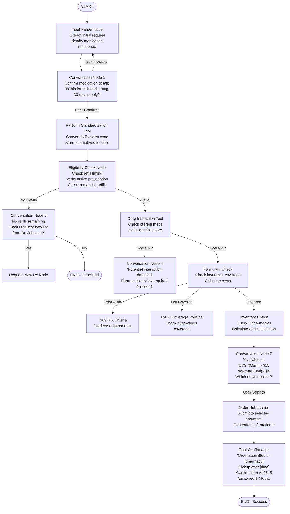

# Pharmacy Refill AI Assistant - Project Implementation Guide

## Project Overview
Building an AI-powered pharmacy refill assistant for Qventus interview challenge. The system demonstrates conversational AI, tool integration, RAG implementation, and mathematical optimization in a healthcare context.

### Position Context
- **Role**: Forward-Deployed AI Solution Architect at Qventus
- **Goal**: Demonstrate ability to architect modular, scalable AI assistants for healthcare operations
- **Time Limit**: 4-6 hours (don't over-engineer)

## Technical Stack
- **Framework**: LangChain + LangGraph (for state management and graph-based conversation flow)
- **LLM**: Any (OpenAI, Claude, or local LLM)
- **Frontend**: Streamlit (Python-based, quick to implement)
- **Vector Store**: FAISS (simple, no infrastructure needed)
- **Embeddings**: OpenAI or HuggingFace embeddings

## Core Architecture

### Workflow Selected: Pharmacy Refill & Escalation
This workflow demonstrates:
- Multi-turn conversations with state management
- Tool integration (APIs)
- RAG for policy retrieval
- Mathematical optimization (cost/distance)
- Multiple escalation paths

### Key Business Value
- Reduces refill processing time from 15-30 min to 2-3 min
- Prevents medication errors through automated interaction checking
- Optimizes costs by suggesting generic alternatives
- Improves patient satisfaction with faster turnaround

## Conversation Flow Architecture

### Main Flow States
1. **Input Parser** → Extract medication request
2. **Confirmation** → Verify medication details with user
3. **RxNorm Standardization** → Convert to standard drug codes (backend only)
4. **Eligibility Check** → Verify prescription status
5. **Drug Interaction Check** → Safety validation (risk score 0-10)
6. **Formulary Check** → Insurance coverage verification
7. **Cost Optimization** → Calculate cheapest options if needed
8. **Inventory Check** → Find best pharmacy location
9. **Order Submission** → Submit to selected pharmacy
10. **Confirmation** → Provide pickup details

### Escalation Paths
- **No Refills** → Request new Rx from provider
- **High Interaction Risk (>7)** → Pharmacist review
- **Prior Auth Needed** → Provider with PA documentation
- **Not Covered** → Offer alternatives with user consent

### Conversation Nodes (User Interaction Points)
- Confirm medication details
- Consent for new Rx request
- Approve alternative medications
- Select pharmacy location
- Confirm final order

## Implementation Components

### 1. Mock APIs to Create

#### RxNorm API (Real API Available)
```python
# Can use real API: https://rxnav.nlm.nih.gov/REST/
# Example: /REST/rxcui.json?name=lisinopril
# No API key required
```

#### Mock Pharmacy Inventory
```python
PHARMACY_INVENTORY = {
    "CVS_12345": {
        "name": "CVS Pharmacy #12345",
        "address": "123 Main St, Austin, TX 78701",
        "lat": 30.2672, "lon": -97.7431,
        "inventory": {
            "lisinopril_10mg": {"quantity": 500, "wait_time": 0.5},
            "metformin_500mg": {"quantity": 1000, "wait_time": 0.5}
        }
    }
    # Add 2-3 more pharmacies
}
```

#### Mock Insurance Formulary
```python
INSURANCE_FORMULARY = {
    "BCBS_TX_001": {
        "covered_drugs": {
            "lisinopril": {"tier": 1, "copay": 10, "prior_auth": False},
            "eliquis": {"tier": 3, "copay": 60, "prior_auth": True}
        }
    }
}
```

#### Mock Pricing Data
```python
DRUG_PRICES = {
    "lisinopril_10mg": {
        "brand": 65.00,
        "generic": 12.00,
        "pharmacy_prices": {
            "CVS": 15.00,
            "Walmart": 4.00,
            "Walgreens": 14.50
        }
    }
}
```

### 2. RAG Implementation

#### Documents for Vector Store
Create policy documents for prior authorization criteria:
```text
ELIQUIS Prior Authorization Criteria:
- Patient must have tried and failed warfarin therapy
- Diagnosis of atrial fibrillation or DVT/PE required
- Age 18 or older
- Approval period: 12 months

LISINOPRIL Coverage Policy:
- No prior authorization required
- First-line therapy for hypertension
- Maximum dose: 40mg daily
```

#### RAG Setup
```python
from langchain.vectorstores import FAISS
from langchain.embeddings import OpenAIEmbeddings

# Create vector store with drug policies
vectorstore = FAISS.from_texts(
    texts=policy_documents,
    embedding=OpenAIEmbeddings()
)

# Query when needed
relevant_policy = vectorstore.similarity_search(
    f"Prior authorization criteria for {drug_name}",
    k=1
)
```

### 3. Mathematical Optimization

#### Pharmacy Selection Algorithm
```python
def optimize_pharmacy_selection(pharmacies, user_location):
    """
    Optimize based on: distance * 2 + wait_time * 10 + price
    """
    scores = []
    for pharmacy in pharmacies:
        distance = calculate_distance(user_location, pharmacy['location'])
        score = (distance * 2) + (pharmacy['wait_time'] * 10) + pharmacy['price']
        scores.append((pharmacy, score))
    return min(scores, key=lambda x: x[1])[0]
```

#### Cost Optimization
```python
def optimize_medication_cost(drug_name, quantity, insurance):
    """
    Compare: brand vs generic, 30-day vs 90-day supply
    """
    options = []
    for variant in ['brand', 'generic']:
        for days in [30, 90]:
            cost = calculate_total_cost(variant, days, insurance)
            options.append({'variant': variant, 'days': days, 'cost': cost})
    return min(options, key=lambda x: x['cost'])
```

### 4. LangGraph State Management

```python
from typing import TypedDict, List
from langgraph.graph import StateGraph, END

class RefillState(TypedDict):
    patient_id: str
    medication: str
    rxnorm_code: str
    dosage: str
    quantity: int
    insurance_id: str
    refills_remaining: int
    interaction_score: float
    formulary_status: str
    selected_pharmacy: str
    alternatives: List[str]
    user_consents: dict
    conversation_history: List[str]

# Define the graph
workflow = StateGraph(RefillState)

# Add nodes
workflow.add_node("input_parser", input_parser_node)
workflow.add_node("confirm_details", confirmation_node)
workflow.add_node("rxnorm_lookup", rxnorm_node)
workflow.add_node("eligibility_check", eligibility_node)
workflow.add_node("interaction_check", interaction_node)
workflow.add_node("formulary_check", formulary_node)
workflow.add_node("rag_pa_criteria", rag_pa_node)
workflow.add_node("cost_optimization", cost_optimizer_node)
workflow.add_node("inventory_check", inventory_node)
workflow.add_node("submit_order", submission_node)

# Add conditional edges
workflow.add_conditional_edges(
    "eligibility_check",
    eligibility_router,
    {
        "no_refills": "request_new_rx",
        "too_early": "inform_wait",
        "valid": "interaction_check"
    }
)
```

### 5. Streamlit Frontend Structure

```python
import streamlit as st
from langgraph_workflow import RefillWorkflow

st.title("Pharmacy Refill Assistant")

# Chat interface
if "messages" not in st.session_state:
    st.session_state.messages = []

# Display chat history
for message in st.session_state.messages:
    with st.chat_message(message["role"]):
        st.write(message["content"])

# User input
if prompt := st.chat_input("Enter your refill request..."):
    # Add to chat history
    st.session_state.messages.append({"role": "user", "content": prompt})

    # Process through LangGraph
    workflow = RefillWorkflow()
    response = workflow.process(prompt)

    # Display assistant response
    st.session_state.messages.append({"role": "assistant", "content": response})
```

## Critical Implementation Points

### Must-Have Features (Core Requirements)
1. **Intent Recognition**: Clear identification of refill requests
2. **Entity Extraction**: Medication, dosage, quantity
3. **Backend Integration**: At least one mock API call
4. **Modular Design**: Separate prompts, logic, and integrations
5. **Error Handling**: Handle missing/ambiguous information

### Bonus Features (If Time Permits)
1. **Multi-turn Clarification**: Handle ambiguous requests
2. **RAG Integration**: Policy and criteria retrieval
3. **Voice Input**: Simple speech-to-text
4. **Analytics Dashboard**: Show optimization metrics

### Key Differentiators to Highlight
1. **Healthcare Domain Knowledge**: Use proper medical terminology (RxNorm, formulary, PA)
2. **Safety First**: Drug interaction checking before cost optimization
3. **User Consent**: Never change medications without explicit approval
4. **Cost Consciousness**: Show savings achieved
5. **Scalability Design**: Modular nodes easily extended to other workflows

## Testing Scenarios

### Happy Path
```
User: "I need to refill my lisinopril"
Bot: "Is this for Lisinopril 10mg, 30-day supply?"
User: "Yes"
Bot: "Available at CVS (0.5mi) for $15 or Walmart (3mi) for $4. Which do you prefer?"
User: "Walmart"
Bot: "Order submitted. Pickup after 2pm. Confirmation #12345. You saved $11!"
```

### Escalation Path
```
User: "Refill my Eliquis"
Bot: "Eliquis requires prior authorization. Shall I send the request to Dr. Johnson?"
User: "Yes"
Bot: "Request sent with required criteria. You'll be notified within 24-48 hours."
```

### Alternative Path
```
User: "Refill my Lipitor"
Bot: "Lipitor (brand) costs $450. Generic atorvastatin is $15. Would you like to switch?"
User: "Yes, switch to generic"
Bot: "Switched to atorvastatin. Available at CVS for pickup in 30 minutes."
```

## Deliverables Checklist

- [ ] Flow diagram (Mermaid or visual)
- [ ] GitHub repo with clean code structure
- [ ] README with setup instructions
- [ ] Core prototype demonstrating:
  - [ ] Intent recognition
  - [ ] Entity extraction
  - [ ] At least one API integration
  - [ ] Conversation state management
  - [ ] One escalation path
- [ ] 1-2 page document on optimization & scalability
- [ ] Clear documentation of AI assistant usage

## Time Management (4-6 hours)

1. **Hour 1**: Setup environment, create mock data
2. **Hour 2**: Build LangGraph workflow structure
3. **Hour 3**: Implement core nodes and conversation logic
4. **Hour 4**: Add RAG and optimization features
5. **Hour 5**: Create Streamlit UI
6. **Hour 6**: Documentation and testing

## Code Structure
```
rxflow-pharmacy-assistant/
├── README.md
├── pyproject.toml            # Poetry configuration
├── poetry.lock              # Poetry lock file
├── .env.example             # Example environment variables
├── .gitignore
├── app.py                   # Streamlit frontend
├── workflow/
│   ├── __init__.py
│   ├── graph.py            # Main LangGraph workflow orchestration
│   ├── state.py            # State definitions and types
│   ├── nodes/              # Individual node implementations
│   │   ├── __init__.py
│   │   ├── input_nodes.py      # Input parser, confirmation nodes
│   │   ├── validation_nodes.py # Eligibility, interaction check nodes
│   │   ├── formulary_nodes.py  # Formulary, cost optimization nodes
│   │   ├── inventory_nodes.py  # Pharmacy inventory, selection nodes
│   │   ├── escalation_nodes.py # Provider, pharmacist escalation nodes
│   │   └── output_nodes.py     # Order submission, confirmation nodes
│   ├── chains/             # Reusable chains and prompts
│   │   ├── __init__.py
│   │   ├── conversation_chains.py  # User interaction chains
│   │   ├── extraction_chains.py    # Entity extraction chains
│   │   ├── decision_chains.py      # Decision-making chains
│   │   └── prompts.py              # All prompt templates
│   └── routers.py          # Conditional edge routers
├── tools/
│   ├── __init__.py
│   ├── rxnorm_api.py       # RxNorm API integration
│   ├── mock_apis.py        # Mock pharmacy/insurance APIs
│   └── optimization.py     # Cost/distance calculations
├── rag/
│   ├── __init__.py
│   ├── documents.py        # PA criteria documents loader
│   ├── vector_store.py     # FAISS setup and management
│   └── retriever.py        # RAG retrieval logic
├── data/
│   ├── mock_patients.json
│   ├── mock_pharmacies.json
│   ├── mock_insurance.json
│   ├── mock_drugs.json
│   └── drug_policies.txt
├── config/
│   ├── __init__.py
│   └── settings.py         # Configuration management
├── utils/
│   ├── __init__.py
│   ├── logger.py           # Logging setup
│   └── helpers.py          # Utility functions
└── tests/
    ├── __init__.py
    ├── test_nodes/
    │   ├── test_input_nodes.py
    │   ├── test_validation_nodes.py
    │   └── test_formulary_nodes.py
    ├── test_chains/
    │   ├── test_conversation_chains.py
    │   └── test_extraction_chains.py
    ├── test_tools/
    │   ├── test_rxnorm_api.py
    │   └── test_optimization.py
    └── test_workflow.py
```

## Workflow Diagram (Mermaid)



## Final Tips
- Keep it simple but impressive - show architecture thinking over complex code
- Document your assumptions clearly
- Focus on the conversation flow - it's a conversational AI role
- Show where AI assistants add value (not just automation)
- Be ready to explain every design decision in the technical interview
- Remember: Qventus values practical solutions that can be deployed in real healthcare settings

## Questions to Be Ready For
1. Why did you choose this particular workflow?
2. How would you handle HIPAA compliance?
3. How would this scale to 1000+ concurrent users?
4. What metrics would you track for success?
5. How would you handle edge cases (patient allergies, drug recalls)?
6. How would you integrate with existing hospital systems (Epic, Cerner)?
7. What's your approach to handling ambiguous user inputs?
8. How would you ensure medication safety?

## Resources
- [RxNorm API Documentation](https://lhncbc.nlm.nih.gov/RxNav/APIs/RxNormAPIs.html)
- [LangGraph Documentation](https://python.langchain.com/docs/langgraph)
- [FHIR Standards for Healthcare](https://www.hl7.org/fhir/)
- [Streamlit Documentation](https://docs.streamlit.io/)
