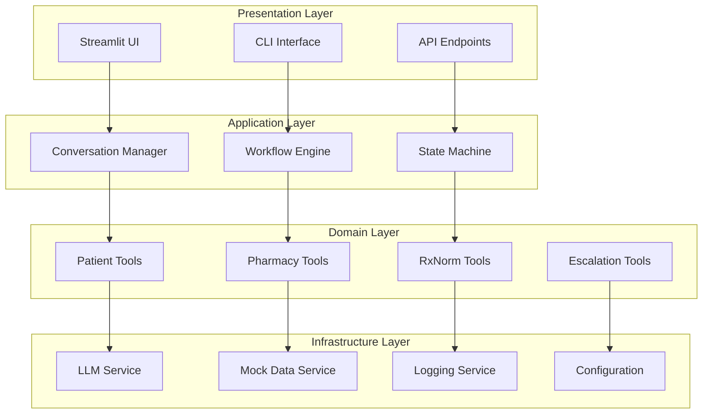

# Developer Guide

## Architecture Overview

RxFlow Pharmacy Assistant is built with a modular, scalable architecture designed for healthcare applications. The system follows clean architecture principles with clear separation of concerns.



## Core Components

### 1. Conversation Management

The conversation system manages AI-powered interactions with multiple conversation types:

```python
# rxflow/workflow/conversation_manager.py
class ConversationManager:
    """Manages different types of conversations and their lifecycles"""
    
    def __init__(self):
        self.conversation_types = {
            'simple': SimpleConversation,
            'refill': RefillConversation,
            'clinical': ClinicalConversation
        }
        self.active_conversations = {}
    
    def start_conversation(self, conversation_type: str, 
                         conversation_id: str) -> ConversationState:
        """Initialize a new conversation of specified type"""
        if conversation_type not in self.conversation_types:
            raise ValueError(f"Unknown conversation type: {conversation_type}")
        
        conversation_class = self.conversation_types[conversation_type]
        conversation = conversation_class(conversation_id)
        
        self.active_conversations[conversation_id] = conversation
        return conversation.get_state()
```

#### Extending Conversation Types

To create a custom conversation type:

```python
from rxflow.workflow.conversation_manager import BaseConversation
from rxflow.workflow.state import ConversationState

class CustomConversation(BaseConversation):
    """Custom conversation for specific use case"""
    
    def __init__(self, conversation_id: str):
        super().__init__(conversation_id)
        self.conversation_type = "custom"
        
    def process_message(self, message: str) -> ConversationState:
        """Process user message and return updated state"""
        # Custom processing logic
        response = self._generate_response(message)
        
        # Update conversation state
        self.state.add_message("user", message)
        self.state.add_message("assistant", response)
        
        return self.state
    
    def _generate_response(self, message: str) -> str:
        """Generate appropriate response for custom conversation"""
        # Implement custom response logic
        pass

# Register the new conversation type
from rxflow.workflow.conversation_manager import ConversationManager

ConversationManager.register_conversation_type("custom", CustomConversation)
```

### 2. Tool Development

Tools provide the core functionality for pharmacy operations. Each tool follows a consistent pattern:

```python
# Template for new tools
from typing import Dict, Any, Optional
from rxflow.utils.logger import get_logger

logger = get_logger(__name__)

class NewTool:
    """Template for creating new pharmacy tools"""
    
    def __init__(self, config: Optional[Dict[str, Any]] = None):
        self.config = config or {}
        self.logger = logger
        
    def primary_function(self, query: str) -> Dict[str, Any]:
        """Main function of the tool
        
        Args:
            query (str): Input query or parameters
            
        Returns:
            Dict[str, Any]: Structured response with success/error status
            
        Examples:
            >>> tool = NewTool()
            >>> result = tool.primary_function("sample query")
            >>> print(result['success'])
            True
        """
        try:
            # Validate input
            if not query or not isinstance(query, str):
                return {
                    "success": False,
                    "error": "Invalid query parameter"
                }
            
            # Process request
            result = self._process_query(query)
            
            # Log successful operation
            self.logger.info(f"Tool operation successful", extra={
                "tool": self.__class__.__name__,
                "query": query[:100],  # Truncate for privacy
                "success": True
            })
            
            return {
                "success": True,
                "data": result,
                "timestamp": self._get_timestamp()
            }
            
        except Exception as e:
            # Log error
            self.logger.error(f"Tool operation failed", extra={
                "tool": self.__class__.__name__,
                "query": query[:100],
                "error": str(e)
            })
            
            return {
                "success": False,
                "error": f"Tool operation failed: {str(e)}"
            }
    
    def _process_query(self, query: str) -> Dict[str, Any]:
        """Internal processing logic - implement in subclass"""
        raise NotImplementedError("Subclasses must implement _process_query")
    
    def _get_timestamp(self) -> str:
        """Get current timestamp in ISO format"""
        from datetime import datetime
        return datetime.utcnow().isoformat() + "Z"

# Safety wrapper function for the tool
def safe_new_tool_operation(query: str) -> Dict[str, Any]:
    """Safe wrapper for NewTool operations
    
    Args:
        query (str): Input query
        
    Returns:
        Dict[str, Any]: Tool response with error handling
        
    Examples:
        >>> result = safe_new_tool_operation("test query")
        >>> if result.get("success"):
        ...     print("Operation successful")
    """
    try:
        tool = NewTool()
        return tool.primary_function(query)
    except Exception as e:
        return {
            "success": False,
            "error": f"Safety wrapper caught error: {str(e)}"
        }
```

#### Tool Integration Pattern

Integrate tools with the conversation system:

```python
# rxflow/tools/tool_manager.py
from typing import Dict, Any, List
from .patient_history_tool import PatientHistoryTool, safe_medication_history
from .pharmacy_tools import PharmacyTool, safe_pharmacy_lookup

class ToolManager:
    """Manages available tools and their execution"""
    
    def __init__(self):
        self.tools = {
            "patient_history": PatientHistoryTool(),
            "pharmacy": PharmacyTool(),
            # Add new tools here
        }
        
        self.safe_functions = {
            "safe_medication_history": safe_medication_history,
            "safe_pharmacy_lookup": safe_pharmacy_lookup,
            # Add new safe functions here
        }
    
    def get_available_tools(self) -> List[str]:
        """Get list of available tool names"""
        return list(self.tools.keys())
    
    def execute_tool(self, tool_name: str, function_name: str, 
                    params: Dict[str, Any]) -> Dict[str, Any]:
        """Execute a specific tool function safely"""
        
        if tool_name not in self.tools:
            return {
                "success": False,
                "error": f"Unknown tool: {tool_name}"
            }
        
        tool = self.tools[tool_name]
        
        if not hasattr(tool, function_name):
            return {
                "success": False,
                "error": f"Tool {tool_name} does not have function {function_name}"
            }
        
        try:
            function = getattr(tool, function_name)
            result = function(**params)
            return result
            
        except Exception as e:
            return {
                "success": False,
                "error": f"Tool execution failed: {str(e)}"
            }
    
    def execute_safe_function(self, function_name: str, 
                            params: Any) -> Dict[str, Any]:
        """Execute a safe wrapper function"""
        
        if function_name not in self.safe_functions:
            return {
                "success": False,
                "error": f"Unknown safe function: {function_name}"
            }
        
        try:
            function = self.safe_functions[function_name]
            result = function(params)
            return result
            
        except Exception as e:
            return {
                "success": False,
                "error": f"Safe function execution failed: {str(e)}"
            }
```

### 3. State Management

The state machine manages conversation flow and context:

```python
# rxflow/workflow/state_machine.py
from enum import Enum
from typing import Dict, Any, Optional, List
from dataclasses import dataclass, field

class ConversationState(Enum):
    """Possible conversation states"""
    INITIALIZED = "initialized"
    GATHERING_INFO = "gathering_info"
    PROCESSING = "processing"
    AWAITING_CONFIRMATION = "awaiting_confirmation"
    COMPLETED = "completed"
    ERROR = "error"

@dataclass
class ConversationContext:
    """Context data for conversations"""
    conversation_id: str
    user_id: Optional[str] = None
    patient_id: Optional[str] = None
    current_medication: Optional[str] = None
    selected_pharmacy: Optional[str] = None
    collected_data: Dict[str, Any] = field(default_factory=dict)
    conversation_history: List[Dict[str, str]] = field(default_factory=list)
    
class StateMachine:
    """Manages conversation state transitions"""
    
    def __init__(self, initial_state: ConversationState = ConversationState.INITIALIZED):
        self.current_state = initial_state
        self.context = ConversationContext("")
        self.state_handlers = {
            ConversationState.INITIALIZED: self._handle_initialized,
            ConversationState.GATHERING_INFO: self._handle_gathering_info,
            ConversationState.PROCESSING: self._handle_processing,
            ConversationState.AWAITING_CONFIRMATION: self._handle_awaiting_confirmation,
            ConversationState.COMPLETED: self._handle_completed,
            ConversationState.ERROR: self._handle_error,
        }
    
    def transition_to(self, new_state: ConversationState, 
                     context_updates: Optional[Dict[str, Any]] = None) -> bool:
        """Transition to a new state with optional context updates"""
        
        if not self._is_valid_transition(self.current_state, new_state):
            return False
        
        # Update context if provided
        if context_updates:
            for key, value in context_updates.items():
                if hasattr(self.context, key):
                    setattr(self.context, key, value)
                else:
                    self.context.collected_data[key] = value
        
        # Perform transition
        old_state = self.current_state
        self.current_state = new_state
        
        # Log state transition
        logger.info("State transition", extra={
            "conversation_id": self.context.conversation_id,
            "from_state": old_state.value,
            "to_state": new_state.value,
            "context_updates": list(context_updates.keys()) if context_updates else []
        })
        
        return True
    
    def process_input(self, user_input: str) -> Dict[str, Any]:
        """Process user input based on current state"""
        
        if self.current_state not in self.state_handlers:
            return {
                "success": False,
                "error": f"No handler for state: {self.current_state}"
            }
        
        handler = self.state_handlers[self.current_state]
        return handler(user_input)
    
    def _is_valid_transition(self, from_state: ConversationState, 
                           to_state: ConversationState) -> bool:
        """Check if state transition is valid"""
        valid_transitions = {
            ConversationState.INITIALIZED: [
                ConversationState.GATHERING_INFO,
                ConversationState.ERROR
            ],
            ConversationState.GATHERING_INFO: [
                ConversationState.PROCESSING,
                ConversationState.GATHERING_INFO,  # Stay in same state
                ConversationState.ERROR
            ],
            ConversationState.PROCESSING: [
                ConversationState.AWAITING_CONFIRMATION,
                ConversationState.COMPLETED,
                ConversationState.ERROR
            ],
            ConversationState.AWAITING_CONFIRMATION: [
                ConversationState.PROCESSING,  # User wants changes
                ConversationState.COMPLETED,
                ConversationState.ERROR
            ],
            ConversationState.COMPLETED: [
                ConversationState.INITIALIZED  # Start new conversation
            ],
            ConversationState.ERROR: [
                ConversationState.INITIALIZED,  # Restart
                ConversationState.GATHERING_INFO  # Retry
            ]
        }
        
        return to_state in valid_transitions.get(from_state, [])
```

## Testing Framework

### Unit Testing

RxFlow uses pytest for comprehensive testing:

```python
# tests/test_patient_history_tool.py
import pytest
from unittest.mock import Mock, patch
from rxflow.tools.patient_history_tool import PatientHistoryTool, safe_medication_history

class TestPatientHistoryTool:
    """Test cases for PatientHistoryTool"""
    
    def setup_method(self):
        """Setup test fixtures"""
        self.tool = PatientHistoryTool()
        self.sample_patient_id = "12345"
        self.sample_medication = "lisinopril"
    
    def test_get_medication_history_success(self):
        """Test successful medication history retrieval"""
        query = f"{self.sample_patient_id}:{self.sample_medication}"
        
        with patch.object(self.tool, '_fetch_patient_data') as mock_fetch:
            mock_fetch.return_value = {
                "medications": [
                    {
                        "name": "lisinopril",
                        "strength": "10mg", 
                        "condition": "hypertension",
                        "last_filled": "2025-01-10"
                    }
                ]
            }
            
            result = self.tool.get_medication_history(query)
            
            assert result["success"] is True
            assert len(result["medications"]) == 1
            assert result["medications"][0]["name"] == "lisinopril"
    
    def test_get_medication_history_invalid_query(self):
        """Test handling of invalid query format"""
        invalid_query = "invalid_format"
        
        result = self.tool.get_medication_history(invalid_query)
        
        assert result["success"] is False
        assert "Invalid query format" in result["error"]
    
    def test_safe_medication_history_wrapper(self):
        """Test safety wrapper function"""
        query = f"{self.sample_patient_id}:{self.sample_medication}"
        
        with patch.object(PatientHistoryTool, 'get_medication_history') as mock_method:
            mock_method.return_value = {"success": True, "medications": []}
            
            result = safe_medication_history(query)
            
            assert result["success"] is True
            mock_method.assert_called_once_with(query)
    
    @pytest.mark.parametrize("adherence_score,expected_level", [
        (95, "Excellent"),
        (85, "Good"),
        (70, "Fair"),
        (50, "Poor"),
        (30, "Very Poor")
    ])
    def test_adherence_level_calculation(self, adherence_score, expected_level):
        """Test adherence level calculation with different scores"""
        query = f"{self.sample_patient_id}:{self.sample_medication}"
        
        with patch.object(self.tool, '_calculate_adherence_score') as mock_calc:
            mock_calc.return_value = adherence_score
            
            result = self.tool.check_adherence(query)
            
            assert result["adherence_level"] == expected_level

# Integration tests
class TestIntegration:
    """Integration tests for tool interactions"""
    
    def test_complete_refill_workflow(self):
        """Test complete prescription refill workflow"""
        from rxflow.workflow.refill_conversation import RefillConversation
        from rxflow.tools.patient_history_tool import PatientHistoryTool
        from rxflow.tools.pharmacy_tools import PharmacyTool
        
        # Mock external dependencies
        with patch.object(PatientHistoryTool, 'get_medication_history') as mock_history, \
             patch.object(PatientHistoryTool, 'check_adherence') as mock_adherence, \
             patch.object(PharmacyTool, 'find_nearby_pharmacies') as mock_pharmacies:
            
            # Setup mocks
            mock_history.return_value = {
                "success": True,
                "medications": [{"name": "lisinopril", "refills_remaining": 2}]
            }
            mock_adherence.return_value = {
                "adherence_score": 85,
                "adherence_level": "Good"
            }
            mock_pharmacies.return_value = {
                "success": True, 
                "pharmacies": [{"id": "CVS001", "name": "CVS Pharmacy"}]
            }
            
            # Test workflow
            conversation = RefillConversation("test_123")
            result = conversation.process_message(
                "I need to refill my blood pressure medication"
            )
            
            assert result.current_state != "error"
            assert "lisinopril" in str(result.context.collected_data)

# Performance tests
class TestPerformance:
    """Performance benchmarks for critical operations"""
    
    def test_medication_lookup_performance(self):
        """Test medication lookup response time"""
        import time
        
        tool = PatientHistoryTool()
        query = "12345:lisinopril"
        
        start_time = time.time()
        result = tool.get_medication_history(query)
        end_time = time.time()
        
        response_time = end_time - start_time
        
        # Should complete within 2 seconds
        assert response_time < 2.0
        assert result is not None

# Run tests with: pytest tests/ -v --cov=rxflow --cov-report=html
```

### Mocking External Services

For testing without external dependencies:

```python
# tests/conftest.py
import pytest
from unittest.mock import Mock

@pytest.fixture
def mock_llm_service():
    """Mock LLM service for testing"""
    mock = Mock()
    mock.generate_response.return_value = "Mocked LLM response"
    return mock

@pytest.fixture  
def mock_patient_data():
    """Mock patient data for testing"""
    return {
        "12345": {
            "medications": [
                {
                    "name": "lisinopril",
                    "strength": "10mg",
                    "condition": "hypertension", 
                    "last_filled": "2025-01-10",
                    "refills_remaining": 2
                }
            ],
            "allergies": [
                {
                    "allergen": "penicillin",
                    "reaction": "rash",
                    "severity": "Moderate"
                }
            ]
        }
    }

@pytest.fixture
def mock_pharmacy_data():
    """Mock pharmacy data for testing"""
    return {
        "90210": [
            {
                "id": "CVS001",
                "name": "CVS Pharmacy #1234",
                "address": "123 Main St",
                "distance": 1.2,
                "rating": 4.5
            }
        ]
    }
```

## Configuration Management

### Environment-based Configuration

```python
# rxflow/config/settings.py
import os
from typing import Dict, Any, Optional
from dataclasses import dataclass

@dataclass
class DatabaseConfig:
    """Database configuration settings"""
    host: str = "localhost"
    port: int = 5432
    username: str = "rxflow"
    password: str = ""
    database: str = "rxflow_dev"
    
@dataclass 
class LLMConfig:
    """LLM service configuration"""
    provider: str = "openai"  # openai, anthropic, etc.
    api_key: str = ""
    model: str = "gpt-4"
    temperature: float = 0.1
    max_tokens: int = 1000
    
@dataclass
class SecurityConfig:
    """Security and encryption settings"""
    secret_key: str = ""
    encryption_key: str = ""
    jwt_expiry_hours: int = 24
    rate_limit_per_minute: int = 60

class Settings:
    """Application settings with environment overrides"""
    
    def __init__(self, environment: str = "development"):
        self.environment = environment
        self.load_environment_variables()
        
        # Configuration objects
        self.database = DatabaseConfig(
            host=os.getenv("DB_HOST", "localhost"),
            port=int(os.getenv("DB_PORT", "5432")),
            username=os.getenv("DB_USERNAME", "rxflow"),
            password=os.getenv("DB_PASSWORD", ""),
            database=os.getenv("DB_DATABASE", f"rxflow_{environment}")
        )
        
        self.llm = LLMConfig(
            provider=os.getenv("LLM_PROVIDER", "openai"),
            api_key=os.getenv("LLM_API_KEY", ""),
            model=os.getenv("LLM_MODEL", "gpt-4"),
            temperature=float(os.getenv("LLM_TEMPERATURE", "0.1")),
            max_tokens=int(os.getenv("LLM_MAX_TOKENS", "1000"))
        )
        
        self.security = SecurityConfig(
            secret_key=os.getenv("SECRET_KEY", "dev-secret-key"),
            encryption_key=os.getenv("ENCRYPTION_KEY", ""),
            jwt_expiry_hours=int(os.getenv("JWT_EXPIRY_HOURS", "24")),
            rate_limit_per_minute=int(os.getenv("RATE_LIMIT_PER_MINUTE", "60"))
        )
    
    def load_environment_variables(self):
        """Load environment-specific variables from .env files"""
        env_file = f".env.{self.environment}"
        
        if os.path.exists(env_file):
            from dotenv import load_dotenv
            load_dotenv(env_file)
        elif os.path.exists(".env"):
            from dotenv import load_dotenv  
            load_dotenv(".env")
    
    def validate_configuration(self) -> Dict[str, Any]:
        """Validate all configuration settings"""
        validation_errors = []
        
        # Validate required LLM settings
        if not self.llm.api_key:
            validation_errors.append("LLM_API_KEY is required")
        
        # Validate security settings for production
        if self.environment == "production":
            if self.security.secret_key == "dev-secret-key":
                validation_errors.append("Production SECRET_KEY must be set")
            
            if not self.security.encryption_key:
                validation_errors.append("Production ENCRYPTION_KEY is required")
        
        # Validate database connection
        if self.environment != "test":
            if not self.database.password and self.environment == "production":
                validation_errors.append("Production database password required")
        
        return {
            "valid": len(validation_errors) == 0,
            "errors": validation_errors
        }

# Usage
settings = Settings(os.getenv("ENVIRONMENT", "development"))
validation = settings.validate_configuration()

if not validation["valid"]:
    raise ValueError(f"Configuration errors: {validation['errors']}")
```

### Feature Flags

Implement feature flags for gradual rollouts:

```python
# rxflow/config/feature_flags.py
from typing import Dict, Any, Optional
import json
import os

class FeatureFlags:
    """Manages feature flags for gradual feature rollouts"""
    
    def __init__(self, config_file: Optional[str] = None):
        self.config_file = config_file or "feature_flags.json"
        self.flags = self._load_flags()
    
    def _load_flags(self) -> Dict[str, Any]:
        """Load feature flags from configuration file"""
        default_flags = {
            "enhanced_drug_checking": True,
            "multi_pharmacy_comparison": True,  
            "advanced_adherence_analytics": False,
            "integration_epic_ehr": False,
            "ai_clinical_recommendations": True,
            "real_time_inventory": False,
            "patient_mobile_app": False
        }
        
        if os.path.exists(self.config_file):
            try:
                with open(self.config_file, 'r') as f:
                    file_flags = json.load(f)
                    default_flags.update(file_flags)
            except Exception as e:
                print(f"Error loading feature flags: {e}")
        
        return default_flags
    
    def is_enabled(self, feature_name: str, user_id: Optional[str] = None) -> bool:
        """Check if a feature is enabled for a user"""
        
        # Check if feature exists
        if feature_name not in self.flags:
            return False
        
        flag_config = self.flags[feature_name]
        
        # Simple boolean flag
        if isinstance(flag_config, bool):
            return flag_config
        
        # Complex flag with rollout percentage or user targeting
        if isinstance(flag_config, dict):
            
            # Check if feature is globally enabled
            if not flag_config.get("enabled", False):
                return False
            
            # Check user whitelist
            whitelist = flag_config.get("whitelist_users", [])
            if user_id and user_id in whitelist:
                return True
            
            # Check rollout percentage
            rollout_percentage = flag_config.get("rollout_percentage", 0)
            if rollout_percentage > 0 and user_id:
                # Simple hash-based percentage rollout
                user_hash = hash(user_id) % 100
                return user_hash < rollout_percentage
            
            return rollout_percentage == 100
        
        return False
    
    def get_flag_value(self, feature_name: str, default_value: Any = None) -> Any:
        """Get the raw value of a feature flag"""
        return self.flags.get(feature_name, default_value)
    
    def set_flag(self, feature_name: str, value: Any) -> None:
        """Set a feature flag value (for testing)"""
        self.flags[feature_name] = value

# Usage throughout the application
feature_flags = FeatureFlags()

# In conversation processing
if feature_flags.is_enabled("ai_clinical_recommendations", user_id):
    # Enable AI clinical recommendations
    recommendations = generate_clinical_recommendations(patient_data)

# In pharmacy tools
if feature_flags.is_enabled("real_time_inventory", user_id):
    # Use real-time inventory checking
    inventory = check_real_time_inventory(pharmacy_id, medication)
else:
    # Use cached inventory data
    inventory = check_cached_inventory(pharmacy_id, medication)
```

## Deployment

### Docker Configuration

```dockerfile
# Dockerfile
FROM python:3.11-slim

# Set working directory
WORKDIR /app

# Install system dependencies
RUN apt-get update && apt-get install -y \
    gcc \
    && rm -rf /var/lib/apt/lists/*

# Copy dependency files
COPY pyproject.toml poetry.lock ./

# Install Poetry and dependencies
RUN pip install poetry && \
    poetry config virtualenvs.create false && \
    poetry install --no-dev

# Copy application code
COPY . .

# Create non-root user
RUN useradd -m -u 1001 rxflow && \
    chown -R rxflow:rxflow /app
USER rxflow

# Health check
HEALTHCHECK --interval=30s --timeout=10s --start-period=5s --retries=3 \
    CMD python -c "import requests; requests.get('http://localhost:8000/health')" || exit 1

# Expose port
EXPOSE 8000

# Start application
CMD ["python", "-m", "rxflow.main"]
```

### Docker Compose for Development

```yaml
# docker-compose.yml
version: '3.8'

services:
  rxflow-app:
    build: .
    ports:
      - "8000:8000"
      - "8501:8501"  # Streamlit port
    environment:
      - ENVIRONMENT=development
      - LLM_API_KEY=${LLM_API_KEY}
      - DB_HOST=postgres
      - DB_PASSWORD=rxflow_dev_pass
    depends_on:
      - postgres
      - redis
    volumes:
      - ./logs:/app/logs
      - ./data:/app/data
    networks:
      - rxflow-network

  postgres:
    image: postgres:15
    environment:
      - POSTGRES_DB=rxflow_dev
      - POSTGRES_USER=rxflow
      - POSTGRES_PASSWORD=rxflow_dev_pass
    ports:
      - "5432:5432"
    volumes:
      - postgres_data:/var/lib/postgresql/data
      - ./init.sql:/docker-entrypoint-initdb.d/init.sql
    networks:
      - rxflow-network

  redis:
    image: redis:7-alpine
    ports:
      - "6379:6379"
    volumes:
      - redis_data:/data
    networks:
      - rxflow-network

  nginx:
    image: nginx:alpine
    ports:
      - "80:80"
      - "443:443"
    volumes:
      - ./nginx.conf:/etc/nginx/nginx.conf
      - ./ssl:/etc/nginx/ssl
    depends_on:
      - rxflow-app
    networks:
      - rxflow-network

volumes:
  postgres_data:
  redis_data:

networks:
  rxflow-network:
    driver: bridge
```

### Kubernetes Deployment

```yaml
# k8s/deployment.yaml
apiVersion: apps/v1
kind: Deployment
metadata:
  name: rxflow-app
  labels:
    app: rxflow-app
spec:
  replicas: 3
  selector:
    matchLabels:
      app: rxflow-app
  template:
    metadata:
      labels:
        app: rxflow-app
    spec:
      containers:
      - name: rxflow-app
        image: rxflow:latest
        ports:
        - containerPort: 8000
        env:
        - name: ENVIRONMENT
          value: "production"
        - name: LLM_API_KEY
          valueFrom:
            secretKeyRef:
              name: rxflow-secrets
              key: llm-api-key
        - name: DB_HOST
          value: "postgres-service"
        - name: DB_PASSWORD
          valueFrom:
            secretKeyRef:
              name: rxflow-secrets
              key: db-password
        livenessProbe:
          httpGet:
            path: /health
            port: 8000
          initialDelaySeconds: 30
          periodSeconds: 10
        readinessProbe:
          httpGet:
            path: /ready
            port: 8000
          initialDelaySeconds: 5
          periodSeconds: 5
        resources:
          requests:
            memory: "512Mi"
            cpu: "250m"
          limits:
            memory: "1Gi"
            cpu: "500m"

---
apiVersion: v1
kind: Service
metadata:
  name: rxflow-service
spec:
  selector:
    app: rxflow-app
  ports:
  - protocol: TCP
    port: 80
    targetPort: 8000
  type: LoadBalancer
```

## Monitoring and Observability

### Structured Logging

```python
# rxflow/utils/logger.py
import logging
import json
import sys
from datetime import datetime
from typing import Dict, Any, Optional

class StructuredLogger:
    """Structured logging for better observability"""
    
    def __init__(self, name: str, level: str = "INFO"):
        self.logger = logging.getLogger(name)
        self.logger.setLevel(getattr(logging, level.upper()))
        
        # Create structured formatter
        formatter = StructuredFormatter()
        
        # Console handler
        console_handler = logging.StreamHandler(sys.stdout)
        console_handler.setFormatter(formatter)
        self.logger.addHandler(console_handler)
        
        # File handler for production
        if os.getenv("ENVIRONMENT") == "production":
            file_handler = logging.FileHandler("logs/rxflow.log")
            file_handler.setFormatter(formatter)
            self.logger.addHandler(file_handler)
    
    def info(self, message: str, **kwargs):
        """Log info level message with structured data"""
        self.logger.info(message, extra={"structured_data": kwargs})
    
    def warning(self, message: str, **kwargs):
        """Log warning level message with structured data"""
        self.logger.warning(message, extra={"structured_data": kwargs})
    
    def error(self, message: str, **kwargs):
        """Log error level message with structured data"""
        self.logger.error(message, extra={"structured_data": kwargs})

class StructuredFormatter(logging.Formatter):
    """Custom formatter for structured logging"""
    
    def format(self, record):
        log_entry = {
            "timestamp": datetime.utcnow().isoformat() + "Z",
            "level": record.levelname,
            "message": record.getMessage(),
            "logger": record.name,
            "module": record.module,
            "function": record.funcName,
            "line": record.lineno
        }
        
        # Add structured data if available
        if hasattr(record, "structured_data"):
            log_entry.update(record.structured_data)
        
        # Add exception info if present
        if record.exc_info:
            log_entry["exception"] = self.formatException(record.exc_info)
        
        return json.dumps(log_entry)

# Usage throughout application
logger = StructuredLogger(__name__)

logger.info("Patient medication lookup", 
           patient_id="12345",
           medication="lisinopril", 
           lookup_type="history",
           response_time_ms=150)
```

### Metrics Collection

```python
# rxflow/utils/metrics.py
import time
from functools import wraps
from typing import Dict, Any, Callable
from collections import defaultdict, Counter
from threading import Lock

class MetricsCollector:
    """Collects and tracks application metrics"""
    
    def __init__(self):
        self.counters = Counter()
        self.histograms = defaultdict(list)
        self.gauges = {}
        self.lock = Lock()
    
    def increment_counter(self, name: str, value: int = 1, tags: Dict[str, str] = None):
        """Increment a counter metric"""
        with self.lock:
            metric_name = self._build_metric_name(name, tags)
            self.counters[metric_name] += value
    
    def record_histogram(self, name: str, value: float, tags: Dict[str, str] = None):
        """Record a histogram value"""
        with self.lock:
            metric_name = self._build_metric_name(name, tags)
            self.histograms[metric_name].append(value)
    
    def set_gauge(self, name: str, value: float, tags: Dict[str, str] = None):
        """Set a gauge value"""
        with self.lock:
            metric_name = self._build_metric_name(name, tags)
            self.gauges[metric_name] = value
    
    def _build_metric_name(self, name: str, tags: Dict[str, str] = None) -> str:
        """Build metric name with tags"""
        if not tags:
            return name
        
        tag_string = ",".join(f"{k}={v}" for k, v in sorted(tags.items()))
        return f"{name}[{tag_string}]"
    
    def get_metrics_summary(self) -> Dict[str, Any]:
        """Get summary of all metrics"""
        with self.lock:
            return {
                "counters": dict(self.counters),
                "histograms": {
                    name: {
                        "count": len(values),
                        "min": min(values) if values else 0,
                        "max": max(values) if values else 0,
                        "avg": sum(values) / len(values) if values else 0
                    }
                    for name, values in self.histograms.items()
                },
                "gauges": dict(self.gauges)
            }

# Global metrics collector
metrics = MetricsCollector()

def track_performance(metric_name: str, tags: Dict[str, str] = None):
    """Decorator to track function performance"""
    def decorator(func: Callable) -> Callable:
        @wraps(func)
        def wrapper(*args, **kwargs):
            start_time = time.time()
            
            try:
                result = func(*args, **kwargs)
                
                # Record success
                success_tags = (tags or {}).copy()
                success_tags["status"] = "success"
                metrics.increment_counter(f"{metric_name}.calls", tags=success_tags)
                
                return result
                
            except Exception as e:
                # Record error
                error_tags = (tags or {}).copy()
                error_tags["status"] = "error"
                error_tags["error_type"] = type(e).__name__
                metrics.increment_counter(f"{metric_name}.calls", tags=error_tags)
                raise
                
            finally:
                # Record execution time
                execution_time = time.time() - start_time
                metrics.record_histogram(f"{metric_name}.duration", 
                                       execution_time * 1000, tags=tags)
        
        return wrapper
    return decorator

# Usage
@track_performance("patient_history_lookup", tags={"tool": "patient_history"})
def get_medication_history(self, query: str) -> Dict[str, Any]:
    # Function implementation
    pass

# Track business metrics
metrics.increment_counter("prescription_refills", tags={"pharmacy": "CVS001"})
metrics.record_histogram("adherence_scores", 85.5, tags={"medication": "lisinopril"})
metrics.set_gauge("active_conversations", 23)
```

## Security Considerations

### Data Protection

```python
# rxflow/utils/encryption.py
from cryptography.fernet import Fernet
from cryptography.hazmat.primitives import hashes
from cryptography.hazmat.primitives.kdf.pbkdf2 import PBKDF2HMAC
import base64
import os
from typing import Union

class DataEncryption:
    """Handles encryption/decryption of sensitive data"""
    
    def __init__(self, password: str = None):
        if password is None:
            password = os.getenv("ENCRYPTION_KEY", "default-dev-key")
        
        self.key = self._derive_key(password)
        self.cipher = Fernet(self.key)
    
    def _derive_key(self, password: str) -> bytes:
        """Derive encryption key from password"""
        password_bytes = password.encode()
        salt = b"rxflow_salt_2025"  # In production, use random salt per encryption
        
        kdf = PBKDF2HMAC(
            algorithm=hashes.SHA256(),
            length=32,
            salt=salt,
            iterations=100000,
        )
        
        key = base64.urlsafe_b64encode(kdf.derive(password_bytes))
        return key
    
    def encrypt(self, data: Union[str, bytes]) -> str:
        """Encrypt sensitive data"""
        if isinstance(data, str):
            data = data.encode()
        
        encrypted_data = self.cipher.encrypt(data)
        return base64.urlsafe_b64encode(encrypted_data).decode()
    
    def decrypt(self, encrypted_data: str) -> str:
        """Decrypt sensitive data"""
        encrypted_bytes = base64.urlsafe_b64decode(encrypted_data.encode())
        decrypted_data = self.cipher.decrypt(encrypted_bytes)
        return decrypted_data.decode()

# Usage for sensitive patient data
encryption = DataEncryption()

# Encrypt patient ID before storing in logs
encrypted_patient_id = encryption.encrypt("patient_12345")
logger.info("Patient lookup", patient_id_encrypted=encrypted_patient_id)

# Encrypt medication names in transit
encrypted_medication = encryption.encrypt("lisinopril")
```

### Input Validation

```python
# rxflow/utils/validation.py
import re
from typing import Any, Dict, List, Optional, Union
from dataclasses import dataclass

@dataclass
class ValidationRule:
    """Defines a validation rule"""
    field: str
    required: bool = True
    min_length: Optional[int] = None
    max_length: Optional[int] = None
    pattern: Optional[str] = None
    allowed_values: Optional[List[str]] = None
    custom_validator: Optional[callable] = None

class InputValidator:
    """Validates user inputs for security and data integrity"""
    
    def __init__(self):
        self.patient_id_pattern = r"^[A-Za-z0-9]{1,20}$"
        self.medication_name_pattern = r"^[A-Za-z0-9\s\-\.]{1,100}$"
        self.zip_code_pattern = r"^\d{5}(-\d{4})?$"
    
    def validate_patient_lookup(self, query: str) -> Dict[str, Any]:
        """Validate patient lookup query"""
        
        if not query or not isinstance(query, str):
            return {
                "valid": False,
                "errors": ["Query must be a non-empty string"]
            }
        
        # Check for potential injection attempts
        dangerous_patterns = [
            r"[<>\"'`]",  # HTML/SQL injection characters
            r"javascript:",  # XSS attempts
            r"data:",  # Data URI schemes
            r"\.\./",  # Path traversal
        ]
        
        for pattern in dangerous_patterns:
            if re.search(pattern, query, re.IGNORECASE):
                return {
                    "valid": False,
                    "errors": ["Query contains potentially dangerous characters"]
                }
        
        # Validate format (patient_id:medication or just patient_id)
        parts = query.split(":")
        if len(parts) > 2:
            return {
                "valid": False,
                "errors": ["Invalid query format. Use 'patient_id' or 'patient_id:medication'"]
            }
        
        # Validate patient ID
        patient_id = parts[0].strip()
        if not re.match(self.patient_id_pattern, patient_id):
            return {
                "valid": False,
                "errors": ["Invalid patient ID format"]
            }
        
        # Validate medication name if provided
        if len(parts) == 2:
            medication = parts[1].strip()
            if medication and not re.match(self.medication_name_pattern, medication):
                return {
                    "valid": False,
                    "errors": ["Invalid medication name format"]
                }
        
        return {"valid": True, "errors": []}
    
    def validate_pharmacy_lookup(self, zip_code: str) -> Dict[str, Any]:
        """Validate pharmacy lookup by ZIP code"""
        
        if not zip_code or not isinstance(zip_code, str):
            return {
                "valid": False,
                "errors": ["ZIP code must be provided"]
            }
        
        zip_code = zip_code.strip()
        
        if not re.match(self.zip_code_pattern, zip_code):
            return {
                "valid": False,
                "errors": ["Invalid ZIP code format. Use XXXXX or XXXXX-XXXX"]
            }
        
        return {"valid": True, "errors": []}
    
    def sanitize_output(self, data: Any) -> Any:
        """Sanitize output data to prevent information leakage"""
        
        if isinstance(data, dict):
            sanitized = {}
            for key, value in data.items():
                # Remove sensitive fields from output
                if key.lower() in ["password", "ssn", "api_key", "token"]:
                    sanitized[key] = "[REDACTED]"
                else:
                    sanitized[key] = self.sanitize_output(value)
            return sanitized
            
        elif isinstance(data, list):
            return [self.sanitize_output(item) for item in data]
            
        elif isinstance(data, str):
            # Remove potential script tags or dangerous content
            sanitized = re.sub(r"<script.*?</script>", "[SCRIPT_REMOVED]", data, flags=re.IGNORECASE | re.DOTALL)
            return sanitized
            
        else:
            return data

# Usage in tools
validator = InputValidator()

def safe_patient_lookup(query: str) -> Dict[str, Any]:
    """Safe patient lookup with input validation"""
    
    # Validate input
    validation = validator.validate_patient_lookup(query)
    if not validation["valid"]:
        return {
            "success": False,
            "error": f"Validation failed: {', '.join(validation['errors'])}"
        }
    
    try:
        # Perform lookup
        tool = PatientHistoryTool()
        result = tool.get_medication_history(query)
        
        # Sanitize output
        sanitized_result = validator.sanitize_output(result)
        
        return sanitized_result
        
    except Exception as e:
        logger.error("Patient lookup failed", 
                    query_hash=hash(query), 
                    error=str(e))
        
        return {
            "success": False,
            "error": "Lookup failed due to system error"
        }
```

This comprehensive developer guide provides the foundation for extending and maintaining the RxFlow Pharmacy Assistant system. It covers architecture, testing, deployment, monitoring, and security considerations essential for healthcare applications.