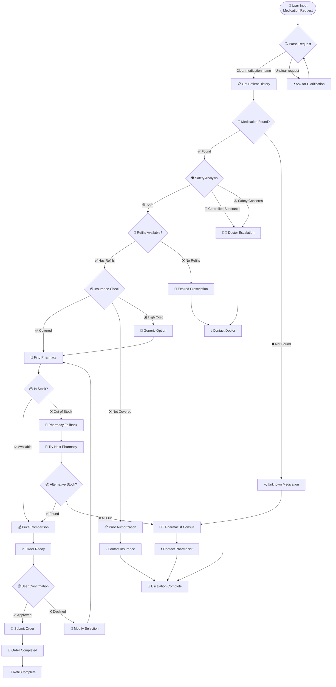
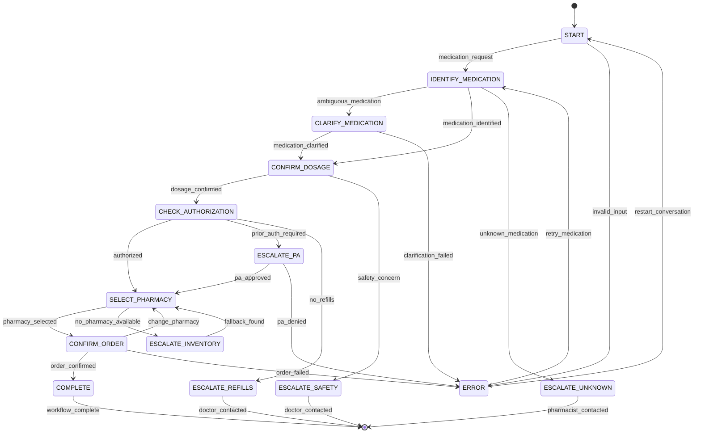
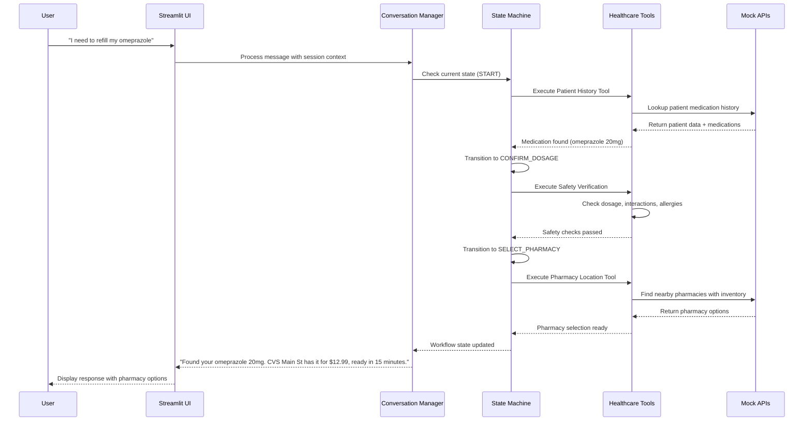
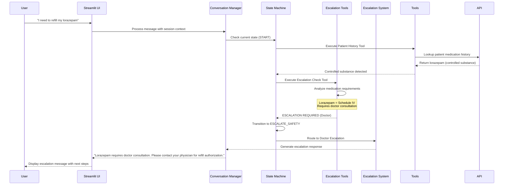
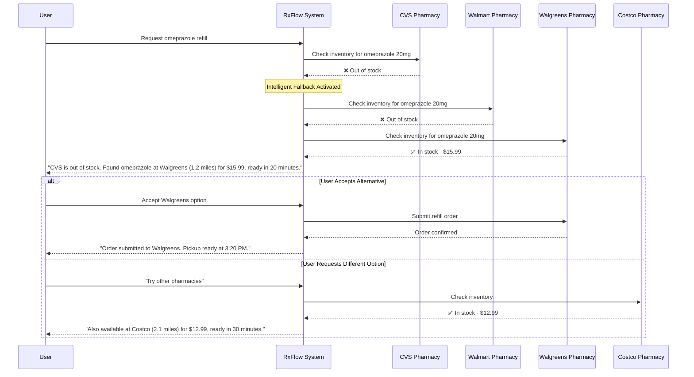
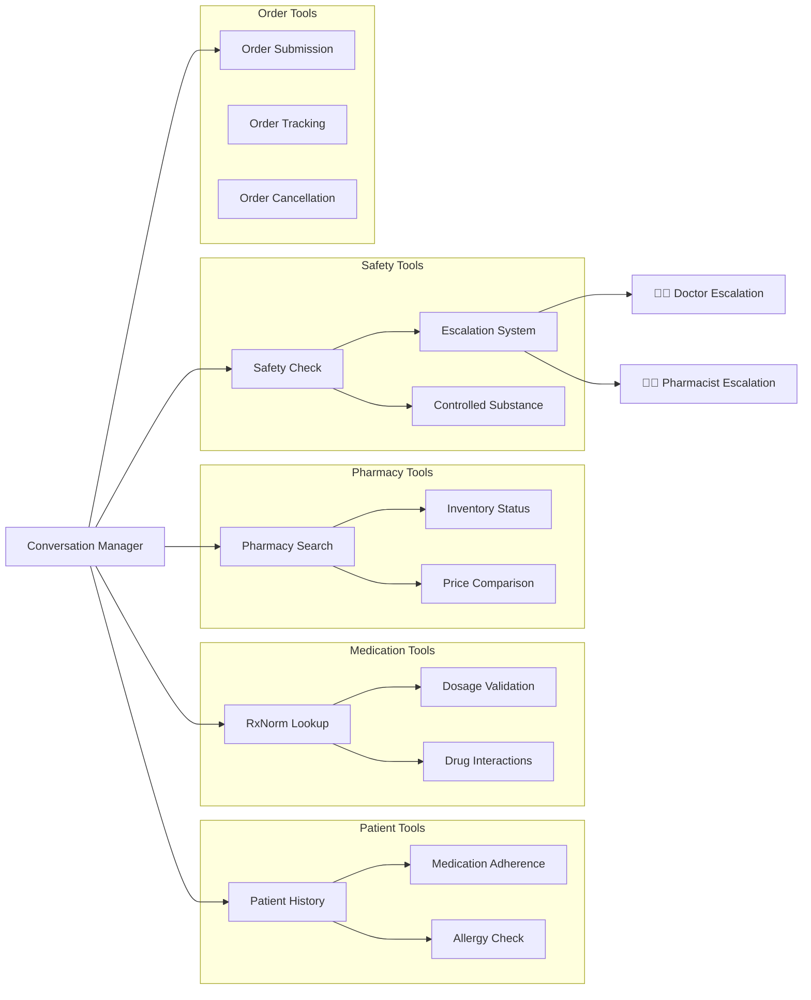
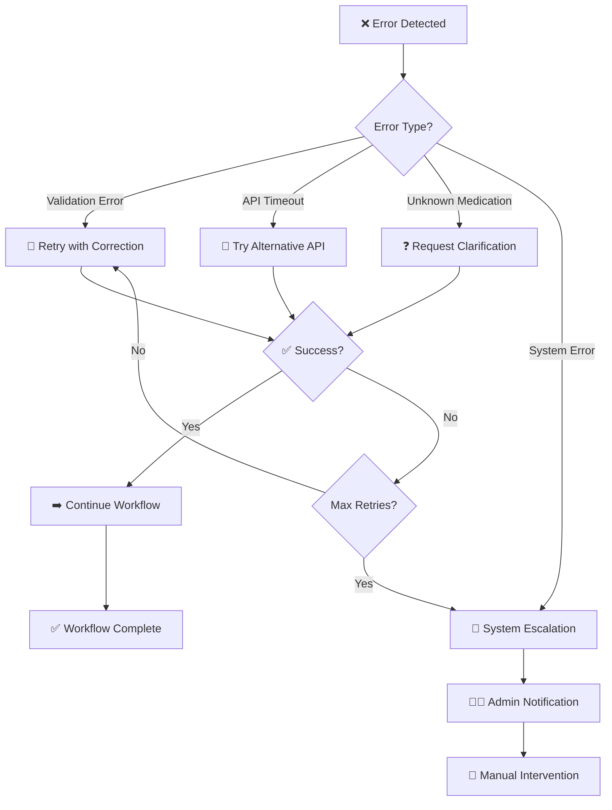

# 🔄 Comprehensive Workflow Diagrams

This page contains detailed workflow diagrams that illustrate how RxFlow processes prescription refill requests through various scenarios.

## 🌳 Interactive Decision Tree

The system uses an intelligent decision tree to route requests through the optimal workflow path:

## 🔧 State Machine Transitions

The RxFlow state machine manages complex workflow transitions with intelligent decision-making:

## 🚀 Advanced Workflow Patterns

### 1. **Happy Path Workflow Sequence**

### 2. **Escalation Workflow Sequence**

### 3. **Pharmacy Fallback Sequence**

## 📊 Tool Integration Flow

## 🎯 Error Handling & Recovery

