# 🔄 Comprehensive Workflow Diagrams

This page contains detailed workflow diagrams that illustrate how RxFlow processes prescription refill requests through various scenarios.

## 🌳 Interactive Decision Tree

The system uses an intelligent decision tree to route requests through the optimal workflow path:

```mermaid
graph TD
    Start([👤 User Input<br/>Medication Request]) --> Parse{🔍 Parse Request}
    
    Parse -->|Clear medication name| GetHistory[📋 Get Patient History]
    Parse -->|Unclear request| Clarify[❓ Ask for Clarification]
    
    GetHistory --> CheckMed{💊 Medication Found?}
    CheckMed -->|✅ Found| SafetyCheck{🛡️ Safety Analysis}
    CheckMed -->|❌ Not Found| UnknownMed[🔍 Unknown Medication]
    
    SafetyCheck -->|🟢 Safe| CheckRefills{💊 Refills Available?}
    SafetyCheck -->|🔴 Controlled Substance| DoctorEsc[👨‍⚕️ Doctor Escalation]
    SafetyCheck -->|⚠️ Safety Concerns| DoctorEsc
    
    CheckRefills -->|✅ Has Refills| Insurance{💳 Insurance Check}
    CheckRefills -->|❌ No Refills| ExpiredRx[📅 Expired Prescription]
    
    Insurance -->|✅ Covered| FindPharmacy[🏥 Find Pharmacy]
    Insurance -->|❌ Not Covered| PriorAuth[📋 Prior Authorization]
    Insurance -->|💰 High Cost| GenericOpt[💊 Generic Option]
    
    FindPharmacy --> CheckStock{📦 In Stock?}
    CheckStock -->|✅ Available| PriceComp[💰 Price Comparison]
    CheckStock -->|❌ Out of Stock| Fallback[🔄 Pharmacy Fallback]
    
    Fallback --> TryNext[🏪 Try Next Pharmacy]
    TryNext --> CheckStock2{📦 Alternative Stock?}
    CheckStock2 -->|✅ Found| PriceComp
    CheckStock2 -->|❌ All Out| PharmacistEsc[👩‍⚕️ Pharmacist Consult]
    
    PriceComp --> OrderReady[✅ Order Ready]
    OrderReady --> Confirm{✋ User Confirmation}
    Confirm -->|✅ Approved| SubmitOrder[📝 Submit Order]
    Confirm -->|❌ Declined| ModifyOrder[🔄 Modify Selection]
    
    SubmitOrder --> Success[🎉 Order Completed]
    
    %% Escalation Endpoints
    DoctorEsc --> ContactDoctor[📞 Contact Doctor]
    ExpiredRx --> ContactDoctor
    PriorAuth --> ContactInsurance[📞 Contact Insurance]
    UnknownMed --> PharmacistEsc
    PharmacistEsc --> ContactPharmacist[📞 Contact Pharmacist]
    
    %% Modification Loops
    ModifyOrder --> FindPharmacy
    Clarify --> Parse
    GenericOpt --> FindPharmacy
    
    %% Final States
    ContactDoctor --> EndEscalation[🏁 Escalation Complete]
    ContactInsurance --> EndEscalation
    ContactPharmacist --> EndEscalation
    Success --> EndSuccess[🎉 Refill Complete]
```

## 🔧 State Machine Transitions

The RxFlow state machine manages complex workflow transitions with intelligent decision-making:

## 🚀 Advanced Workflow Patterns

### 1. **Happy Path Workflow Sequence**

### 2. **Escalation Workflow Sequence**

### 3. **Pharmacy Fallback Sequence**

## 📊 Tool Integration Flow

```mermaid
graph LR
    subgraph "Patient Tools"
        PH[Patient History]
        MA[Medication Adherence]
        AL[Allergy Check]
    end
    
    subgraph "Medication Tools"
        RX[RxNorm Lookup]
        DV[Dosage Validation]
        DI[Drug Interactions]
    end
    
    subgraph "Pharmacy Tools"
        PS[Pharmacy Search]
        IS[Inventory Status]
        PC[Price Comparison]
    end
    
    subgraph "Safety Tools"
        SC[Safety Check]
        ES[Escalation System]
        CS[Controlled Substance]
    end
    
    subgraph "Order Tools"
        OS[Order Submission]
        OT[Order Tracking]
        OC[Order Cancellation]
    end
    
    CM[Conversation Manager] --> PH
    CM --> RX
    CM --> PS
    CM --> SC
    CM --> OS
    
    PH --> MA
    PH --> AL
    RX --> DV
    RX --> DI
    PS --> IS
    PS --> PC
    SC --> ES
    SC --> CS
    
    ES --> Doctor[👨‍⚕️ Doctor Escalation]
    ES --> Pharmacist[👩‍⚕️ Pharmacist Escalation]
```

## 🎯 Error Handling & Recovery

```mermaid
graph TD
    Error[❌ Error Detected] --> Type{Error Type?}
    
    Type -->|Validation Error| Retry[🔄 Retry with Correction]
    Type -->|API Timeout| Fallback[🔄 Try Alternative API]
    Type -->|Unknown Medication| Clarify[❓ Request Clarification]
    Type -->|System Error| Escalate[🚨 System Escalation]
    
    Retry --> Success{✅ Success?}
    Fallback --> Success
    Clarify --> Success
    
    Success -->|Yes| Continue[➡️ Continue Workflow]
    Success -->|No| MaxRetries{Max Retries?}
    
    MaxRetries -->|No| Retry
    MaxRetries -->|Yes| Escalate
    
    Escalate --> Admin[👨‍💻 Admin Notification]
    Admin --> Manual[🤲 Manual Intervention]
    
    Continue --> Complete[✅ Workflow Complete]
```

