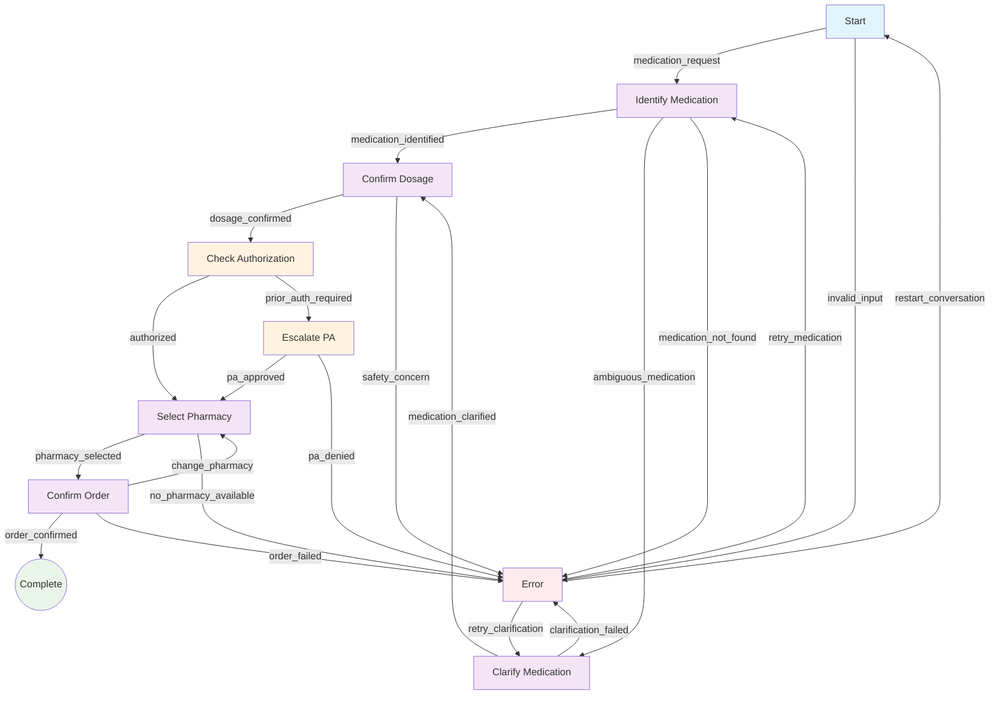

# Pharmacy Refill Workflow - State Machine Diagram

This document contains the complete state machine diagram for the pharmacy refill AI assistant workflow.

## State Machine Flow Diagram



## Tool Usage by State

### IDENTIFY_MEDICATION
- **patient_medication_history**: Look up current medications
- **rxnorm_medication_lookup**: Verify medication exists and get details
- **AI Processing**: Parse user input, match to patient history

### CLARIFY_MEDICATION  
- **verify_medication_dosage**: Check if dosage is valid
- **AI Processing**: Generate clarifying questions if needed

### CONFIRM_DOSAGE (Safety Check)
- **check_drug_interactions**: Check for dangerous interactions
- **patient_allergies**: Verify no allergy conflicts
- **AI Processing**: Evaluate safety and explain any concerns

### CHECK_AUTHORIZATION
- **insurance_formulary_check**: Check coverage and copay
- **prior_authorization_lookup**: Get PA requirements if needed
- **AI Processing**: Explain coverage details and PA process

### SELECT_PHARMACY
- **find_nearby_pharmacies**: Get pharmacy locations and details
- **check_pharmacy_inventory**: Verify medication in stock
- **pharmacy_wait_times**: Get current wait times
- **AI Processing**: Present options based on patient preferences

### Cost Optimization
- **goodrx_price_lookup**: Get cash prices and discount options
- **compare_brand_generic_prices**: Show generic savings
- **AI Processing**: Calculate and present savings opportunities

### CONFIRM_ORDER
- **AI Processing**: Summarize all details, get final confirmation
- **submit_refill_order**: Actually submit the prescription request

## Conversation Flow Examples

### Happy Path
```
User: "I need to refill my lisinopril"
🤖 AI: "I'll help you refill Lisinopril. Let me check your current prescription..."
🔧 Tool: patient_medication_history("lisinopril") 
🤖 AI: "I see you take Lisinopril 10mg. Is this for a 30-day supply?"
User: "Yes"
🔧 Tool: check_drug_interactions("lisinopril")
🔧 Tool: insurance_formulary_check("lisinopril")
🤖 AI: "Great! Lisinopril is covered with a $10 copay. I found it at CVS (0.5mi) and Walmart (3mi)..."
🔧 Tool: goodrx_price_lookup("lisinopril:10mg:30")
🤖 AI: "Walmart has the same $10 copay but shorter wait time. Shall I order it there?"
User: "Yes"
🤖 AI: "Perfect! Order confirmed for pickup after 2 PM. Confirmation #RX12345."
```

### Prior Authorization Path
```
User: "Refill my Eliquis"
🔧 Tool: patient_medication_history("eliquis")
🔧 Tool: insurance_formulary_check("eliquis")
🤖 AI: "Eliquis requires prior authorization. With your AFib diagnosis, you meet the criteria..."
🔧 Tool: prior_authorization_lookup("eliquis") 
🤖 AI: "I can start the PA process with your doctor. It typically takes 3-5 days. Shall I proceed?"
User: "Yes"
🤖 AI: "PA request submitted. You'll be notified when approved. Here's your reference number..."
```

### Safety Concern Path
```
User: "Refill lisinopril, and I've been taking ibuprofen for pain"
🔧 Tool: check_drug_interactions("lisinopril")
🤖 AI: "I found a potential interaction between Lisinopril and ibuprofen that could affect your blood pressure control..."
🤖 AI: "I recommend discussing this with your doctor before we proceed. Would you like me to provide information to share with them?"
```

## State Transitions

| From State | Trigger | To State | Tools Used |
|------------|---------|----------|------------|
| START | User mentions medication | IDENTIFY_MEDICATION | patient_medication_history |
| IDENTIFY_MEDICATION | Medication found | CLARIFY_MEDICATION | verify_medication_dosage |
| IDENTIFY_MEDICATION | Medication unclear | DISAMBIGUATE | None (AI generation) |
| CLARIFY_MEDICATION | Details confirmed | CONFIRM_DOSAGE | check_drug_interactions, patient_allergies |
| CONFIRM_DOSAGE | Safety OK | CHECK_AUTHORIZATION | insurance_formulary_check |
| CONFIRM_DOSAGE | Safety concern | ESCALATE_SAFETY | None (AI explanation) |
| CHECK_AUTHORIZATION | Covered, no PA | SELECT_PHARMACY | find_nearby_pharmacies |
| CHECK_AUTHORIZATION | PA required | ESCALATE_PA | prior_authorization_lookup |
| SELECT_PHARMACY | Pharmacy chosen | CONFIRM_ORDER | goodrx_price_lookup |
| CONFIRM_ORDER | Confirmed | COMPLETE | submit_refill_order |

## AI vs Tool Responsibilities

### AI Responsibilities (🤖)
- Natural language understanding and generation
- User intent recognition and entity extraction
- Explaining complex medical/insurance information
- Asking clarifying questions
- Generating conversational responses
- Decision making for workflow transitions
- Safety concern explanations

### Tool Responsibilities (🔧)
- Data retrieval (patient history, drug info)
- External API calls (RxNorm, insurance systems)
- Price and inventory lookups
- Validation (dosage verification, interaction checking)
- Order submission
- Structured data processing

This separation ensures the AI focuses on conversation and decision-making while tools handle data operations and external integrations.