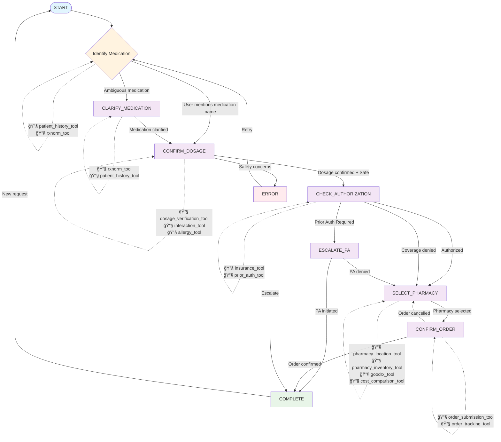

# Pharmacy Refill AI Assistant - Flow Diagram

## Overview
This document contains the complete state machine flow diagram for the pharmacy refill AI assistant, showing conversation states, transitions, tool usage, and decision points.

## State Machine Flow Diagram



## Detailed State Descriptions

### START State
**Purpose**: Initial entry point for user interaction
**Tools Used**: None (conversation initiation)
**Transitions**:
- â¡ï¸ IDENTIFY_MEDICATION: When user mentions refill need
**Example Input**: "Hi, I need to refill my medication"
**AI Usage**: Extract intent and medication mentions from user input

### IDENTIFY_MEDICATION State
**Purpose**: Extract and identify the specific medication
**Tools Used**:
- 🔧 `patient_medication_history`: Check current medications
- 🔧 `rxnorm_medication_lookup`: Verify medication names
**Transitions**:
- â¡ï¸ CONFIRM_DOSAGE: Clear medication identified
- â¡ï¸ CLARIFY_MEDICATION: Ambiguous medication name
- 🔄 IDENTIFY_MEDICATION: No medication mentioned
**Example Inputs**: 
- Clear: "lisinopril 10mg"
- Ambiguous: "blood pressure medication"
**AI Usage**: NLP to extract medication names, fuzzy matching

### CLARIFY_MEDICATION State
**Purpose**: Resolve medication ambiguity through clarifying questions
**Tools Used**:
- 🔧 `patient_medication_history`: Show current medications
- 🔧 `rxnorm_medication_lookup`: Find similar medications
**Transitions**:
- â¡ï¸ CONFIRM_DOSAGE: Medication clarified
- 🔄 CLARIFY_MEDICATION: Still needs clarification
**Example Interaction**:
- AI: "I found several blood pressure medications. Are you referring to lisinopril, amlodipine, or metoprolol?"
- User: "Lisinopril"
**AI Usage**: Generate disambiguation questions, process clarification

### CONFIRM_DOSAGE State
**Purpose**: Verify dosage and perform safety checks
**Tools Used**:
- 🔧 `verify_medication_dosage`: Validate dosage appropriateness
- 🔧 `check_drug_interactions`: Safety screening
- 🔧 `patient_allergies`: Allergy verification
**Transitions**:
- â¡ï¸ CHECK_AUTHORIZATION: Safety checks pass
- â¡ï¸ ERROR: Safety concerns identified
**Safety Checks**:
- Dosage within normal range
- No dangerous drug interactions
- No known allergies
**AI Usage**: Interpret safety data, generate safety warnings

### CHECK_AUTHORIZATION State
**Purpose**: Verify insurance coverage and prior authorization
**Tools Used**:
- 🔧 `insurance_formulary_check`: Check coverage
- 🔧 `prior_authorization_lookup`: PA requirements
**Transitions**:
- â¡ï¸ SELECT_PHARMACY: Coverage approved
- â¡ï¸ ESCALATE_PA: Prior authorization required
- â¡ï¸ SELECT_PHARMACY: Coverage denied (cash pay)
**Coverage Scenarios**:
- ✅ Covered: Direct to pharmacy selection
- â³ PA Required: Escalation workflow
- ⌠Not covered: Cash pay options
**AI Usage**: Explain coverage decisions, guide through alternatives

### ESCALATE_PA State
**Purpose**: Handle prior authorization process
**Tools Used**:
- 🔧 `prior_authorization_lookup`: PA status tracking
**Transitions**:
- â¡ï¸ COMPLETE: PA initiated successfully
- â¡ï¸ SELECT_PHARMACY: PA denied, continue with cash
**PA Process**:
1. Initiate PA request with doctor
2. Provide timeline expectations
3. Offer interim solutions
**AI Usage**: Explain PA process, set expectations, provide alternatives

### SELECT_PHARMACY State
**Purpose**: Find optimal pharmacy considering cost, location, and availability
**Tools Used**:
- 🔧 `find_nearby_pharmacies`: Location-based search
- 🔧 `check_pharmacy_inventory`: Availability verification
- 🔧 `goodrx_price_lookup`: Cost comparison
- 🔧 `pharmacy_wait_times`: Service timing
**Transitions**:
- â¡ï¸ CONFIRM_ORDER: Pharmacy selected
- 🔄 SELECT_PHARMACY: Need different options
**Selection Criteria**:
- 📠Distance/convenience
- 💰 Cost optimization
- â° Wait times
- 📦 Inventory availability
**AI Usage**: Rank pharmacy options, explain cost savings, recommend best choice

### CONFIRM_ORDER State
**Purpose**: Final order confirmation and processing
**Tools Used**:
- 🔧 `submit_refill_order`: Process the order
- 🔧 `get_order_status`: Track submission
**Transitions**:
- â¡ï¸ COMPLETE: Order confirmed and submitted
- â¡ï¸ SELECT_PHARMACY: User wants different pharmacy
**Order Details**:
- Medication and dosage confirmation
- Pharmacy details
- Pickup time estimate
- Cost breakdown
**AI Usage**: Summarize order details, confirm accuracy, process submission

### COMPLETE State
**Purpose**: Successful workflow completion with summary
**Tools Used**: None (summary generation)
**Transitions**:
- â¡ï¸ START: New refill request
**Completion Summary**:
- ✅ Order confirmation number
- 📠Pharmacy pickup location
- â° Estimated pickup time
- 💰 Cost savings achieved
- 📠Next steps and contact info
**AI Usage**: Generate completion summary, celebrate savings, provide next steps

### ERROR State
**Purpose**: Handle errors and provide recovery options
**Tools Used**: Context-dependent recovery tools
**Transitions**:
- â¡ï¸ IDENTIFY_MEDICATION: Restart process
- â¡ï¸ COMPLETE: Escalate to human
**Error Types**:
- 🚫 Safety contraindications
- ⌠System errors
- âš ï¸ Invalid inputs
- 🔄 Timeout scenarios
**AI Usage**: Explain errors clearly, provide recovery options, escalate when needed

## Tool Usage Matrix

| State | Primary Tools | Secondary Tools | Purpose |
|-------|---------------|-----------------|---------|
| START | None | None | Conversation initiation |
| IDENTIFY_MEDICATION | patient_history_tool, rxnorm_tool | None | Medication identification |
| CLARIFY_MEDICATION | patient_history_tool, rxnorm_tool | None | Disambiguation |
| CONFIRM_DOSAGE | dosage_verification_tool, interaction_tool | allergy_tool | Safety verification |
| CHECK_AUTHORIZATION | insurance_tool | prior_auth_tool | Coverage verification |
| ESCALATE_PA | prior_auth_tool | None | PA process management |
| SELECT_PHARMACY | pharmacy_location_tool, goodrx_tool | pharmacy_inventory_tool, wait_times_tool | Pharmacy optimization |
| CONFIRM_ORDER | order_submission_tool | order_tracking_tool | Order processing |
| COMPLETE | None | None | Summary generation |
| ERROR | Context-dependent | None | Error recovery |

## Decision Points and Branching Logic

### Medication Identification Decision
```
if medication_clearly_identified:
    → CONFIRM_DOSAGE
elif medication_ambiguous:
    → CLARIFY_MEDICATION
else:
    → stay in IDENTIFY_MEDICATION
```

### Safety Check Decision
```
if dosage_valid and no_interactions and no_allergies:
    → CHECK_AUTHORIZATION
else:
    → ERROR (with safety warnings)
```

### Authorization Decision
```
if covered_by_insurance:
    → SELECT_PHARMACY
elif prior_auth_required:
    → ESCALATE_PA
else:
    → SELECT_PHARMACY (cash pay option)
```

### Prior Auth Decision
```
if pa_approved:
    → SELECT_PHARMACY
elif pa_initiated:
    → COMPLETE (with follow-up instructions)
else:
    → SELECT_PHARMACY (cash alternatives)
```

## Happy Path Flow
The typical successful conversation follows this path:
1. **START** → User: "I need to refill my lisinopril"
2. **IDENTIFY_MEDICATION** → AI identifies lisinopril using tools
3. **CONFIRM_DOSAGE** → AI verifies 10mg dosage, checks safety
4. **CHECK_AUTHORIZATION** → AI confirms insurance coverage
5. **SELECT_PHARMACY** → AI finds best pharmacy option with savings
6. **CONFIRM_ORDER** → AI processes order successfully
7. **COMPLETE** → AI provides pickup details and celebrates savings

## Escalation Paths
- **Safety Issues**: CONFIRM_DOSAGE → ERROR → Human escalation
- **Prior Authorization**: CHECK_AUTHORIZATION → ESCALATE_PA → Manual PA process
- **System Errors**: Any state → ERROR → Recovery or escalation

## Conversation Flow Examples

### Happy Path Example
```
User: "I need to refill my lisinopril"
🤖 AI: "I'll help you refill Lisinopril. Let me check your current prescription..."
🔧 Tool: patient_medication_history("lisinopril") 
🤖 AI: "I see you take Lisinopril 10mg. Is this for a 30-day supply?"
User: "Yes"
🔧 Tool: check_drug_interactions("lisinopril")
🔧 Tool: insurance_formulary_check("lisinopril")
🤖 AI: "Great! Lisinopril is covered with a $10 copay. I found it at CVS (0.5mi) and Walmart (3mi)..."
🔧 Tool: goodrx_price_lookup("lisinopril:10mg:30")
🤖 AI: "Walmart has the same $10 copay but shorter wait time. Shall I order it there?"
User: "Yes"
🔧 Tool: submit_refill_order(...)
🤖 AI: "Perfect! Order confirmed for pickup after 2 PM. Confirmation #RX12345. You saved $15!"
```

### Prior Authorization Path Example
```
User: "Refill my Eliquis"
🔧 Tool: patient_medication_history("eliquis")
🔧 Tool: insurance_formulary_check("eliquis")
🤖 AI: "Eliquis requires prior authorization. With your AFib diagnosis, you meet the criteria..."
🔧 Tool: prior_authorization_lookup("eliquis") 
🤖 AI: "I can start the PA process with your doctor. It typically takes 3-5 days. Shall I proceed?"
User: "Yes"
🔧 Tool: prior_authorization_request(...)
🤖 AI: "PA request submitted to Dr. Smith. You'll be notified when approved. Reference: PA789."
```

### Safety Concern Example
```
User: "Refill lisinopril, and I've been taking ibuprofen for pain"
🔧 Tool: check_drug_interactions("lisinopril")
🤖 AI: "âš ï¸ I found a potential interaction between Lisinopril and ibuprofen that could affect your blood pressure..."
🤖 AI: "I recommend discussing this with your doctor before proceeding. Would you like me to provide information to share with them?"
User: "Yes, please"
🤖 AI: "I'll prepare a summary of the interaction for your doctor visit..."
```

## AI Usage Patterns
Throughout the flow, AI is used for:
- 🧠 **Natural Language Understanding**: Extract medication names, dosages, preferences
- 🔠**Information Retrieval**: Query tools for patient data, drug information, prices
- âš–ï¸ **Decision Making**: Evaluate safety, select best pharmacy, optimize costs
- 💬 **Response Generation**: Create helpful, contextual responses
- 🯠**Goal Achievement**: Guide users through complete refill workflow

This flow diagram ensures a comprehensive, safe, and cost-effective medication refill experience with proper AI integration at each step.

This separation ensures the AI focuses on conversation and decision-making while tools handle data operations and external integrations.