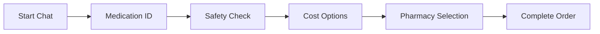

# Quick Start Guide

Get up and running with RxFlow in just a few minutes! This guide walks you through your first prescription refill workflow.

## 🎯 **Your First Refill**

### Step 1: Start the Application

```bash
# Navigate to your RxFlow directory
cd rxflow-pharmacy-assistant

# Start the Streamlit interface
streamlit run app.py
```

The application will open in your browser at `http://localhost:8501`.

### Step 2: Begin a Conversation

You'll see the RxFlow interface with a chat box. Try one of these starter messages:

!!! example "Starter Messages"
    === "Basic Refill"
        ```
        I need to refill my omeprazole
        ```
    
    === "Multiple Medications"
        ```
        I need refills for my blood pressure medications
        ```
    
    === "Find Cheapest Option"
        ```
        What's the cheapest way to get my lisinopril?
        ```
    
    === "Pharmacy Location"
        ```
        Where's the nearest CVS pharmacy?
        ```

### Step 3: Follow AI Guidance

RxFlow will guide you step-by-step through the process:



## 💡 **Interactive Workflow Example**

Here's what a typical conversation looks like:

!!! example "Sample Conversation Flow"
    
    **You:** "I need to refill my omeprazole"
    
    **RxFlow:** "I found your omeprazole 20mg for acid reflux in your medication history. Is this the medication you want to refill?"
    
    **You:** "Yes, that's correct"
    
    **RxFlow:** "Great! Let me verify the dosage for safety... ✅ Dosage verified. Now let me show you cost options:
    
    - **Generic Omeprazole**: $12.99 (90-day supply)
    - **Prilosec Brand**: $45.99 (90-day supply)  
    - **Your Savings**: $33.00 with generic
    
    Which option would you prefer?"
    
    **You:** "I'll take the generic option"
    
    **RxFlow:** "Excellent choice! Now let me find nearby pharmacies with the best prices and shortest wait times..."

## 🎮 **Quick Actions**

Use the **Quick Actions** sidebar for common requests:

### Medication Actions
- 🔄 **"Refill Medication"** - Start a basic refill request
- 💊 **"Check My Medications"** - View your medication history
- ⚠️ **"Prior Authorization"** - Handle insurance issues

### Pharmacy Services  
- 🏥 **"Find Pharmacy"** - Locate nearby pharmacies
- ⏱️ **"Check Wait Times"** - See current pharmacy queues
- 💰 **"Compare Prices"** - Get cost comparisons

### Test Scenarios
- 🚫 **"No Refills Left"** - Handle prescription renewal
- 💳 **"Insurance Denied"** - Work through coverage issues
- ⚡ **"Emergency Refill"** - Urgent medication needs

## 🎛️ **Interface Overview**

### Main Chat Area
- **Conversation History**: All your interactions with RxFlow
- **Message Input**: Type your requests or questions
- **Quick Send**: Pre-written message buttons

### Sidebar Features
=== "Configuration"
    - **Demo Data**: Sample patient and pharmacy information
    - **Session Controls**: Reset conversation or export data
    - **Debug Info**: Toggle technical details
    
=== "Real-time Status"
    - **Current State**: See your workflow progress
    - **Tools Used**: Monitor system operations
    - **Cost Tracking**: View savings and comparisons

## 📱 **Key Features to Try**

### 1. Smart Medication Matching
```
Try: "I need my heartburn medicine"
RxFlow will identify this as omeprazole from your history
```

### 2. Safety Escalation
```
Try: "I need to refill my lorazepam"  
RxFlow will escalate controlled substances to a pharmacist
```

### 3. Cost Optimization
```
Try: "Find me the cheapest option for my medications"
RxFlow will compare prices across multiple pharmacies
```

### 4. Location Services
```
Try: "Which pharmacy is closest to downtown?"
RxFlow will find nearby locations with distances
```

## 🛡️ **Safety Features in Action**

RxFlow automatically protects you with:

### Automatic Safety Checks
- ✅ **Drug Interactions**: Checks against your medication list
- ✅ **Allergy Verification**: Cross-references known allergies  
- ✅ **Dosage Validation**: Ensures safe medication strengths
- ✅ **Controlled Substances**: Escalates to pharmacist review

### Interactive Confirmations
- 🔍 **Medication Verification**: "Is this the correct medication?"
- 💊 **Dosage Confirmation**: "Is 20mg the right strength?"
- 🏥 **Pharmacy Selection**: "Would you like to use this pharmacy?"

## 📊 **Understanding the Interface**

### Workflow States
Monitor your progress through these states:

| State | Description | Next Steps |
|-------|-------------|------------|
| 🏁 **GREETING** | Initial welcome | Share your medication needs |
| 🔍 **MEDICATION_SEARCH** | Finding your medication | Confirm medication details |
| ⚡ **ESCALATED** | Safety review needed | Wait for pharmacist contact |
| 💰 **COST_ANALYSIS** | Comparing options | Choose preferred option |
| 🏥 **PHARMACY_SELECTION** | Finding locations | Select pharmacy |
| 📝 **ORDER_PROCESSING** | Submitting request | Review and confirm |
| ✅ **COMPLETED** | Process finished | Pick up medication |

### Tool Activity Monitor
Watch real-time tool usage:
- 👤 **Patient Tools**: Medication history, allergies
- 🏥 **Pharmacy Tools**: Location, inventory, wait times
- 💊 **Medication Tools**: RxNorm lookup, interactions
- 💰 **Cost Tools**: Insurance, pricing, savings
- 🛡️ **Safety Tools**: Escalation detection

## 🎯 **Pro Tips**

### Efficient Communication
!!! tip "Communication Best Practices"
    - **Be Specific**: "omeprazole 20mg" vs "my heartburn pills"
    - **Confirm Quickly**: Respond "yes" or "no" to confirmation questions
    - **Ask Questions**: "What insurance do you accept?" or "How long is the wait?"

### Using Demo Data
The system includes sample data for testing:
- **Patient ID**: 12345 (John Smith)
- **Sample Medications**: omeprazole, lisinopril, metformin
- **Test Pharmacies**: CVS Main St, Walgreens Downtown
- **Sample Insurance**: BlueCross BlueShield

### Troubleshooting
=== "Conversation Stuck?"
    Use the **"Reset Conversation"** button in the sidebar to start fresh.

=== "Unexpected Response?"
    Check the **"Debug Info"** toggle to see technical details.

=== "Need Help?"
    Try saying **"help"** or **"what can you do?"** for guidance.

## 🚀 **Advanced Usage**

### Multiple Medications
```
"I need refills for omeprazole, lisinopril, and metformin"
```
RxFlow will process each medication individually with safety checks.

### Insurance Scenarios
```
"My insurance denied my prescription, what are my options?"
```
RxFlow will explore alternatives, generic options, and assistance programs.

### Pharmacy Preferences
```
"I only want to use CVS pharmacies"
```
RxFlow will filter results to your preferred pharmacy chain.

## 📈 **Next Steps**

Once you're comfortable with the basics:

1. **[User Guide](../user-guide/interface.md)** - Master advanced features
2. **[Safety Features](../user-guide/safety.md)** - Understand safety protocols
3. **[Pharmacy Services](../user-guide/pharmacy-services.md)** - Explore all pharmacy tools
4. **[Configuration](configuration.md)** - Customize your experience

---

!!! success "You're Ready!"
    You now know the basics of RxFlow! Start with a simple refill request and explore the features as you go. The system will guide you through each step safely and efficiently.

Need more help? Check out our **[Complete User Guide](../user-guide/interface.md)** or try the interactive demo scenarios!