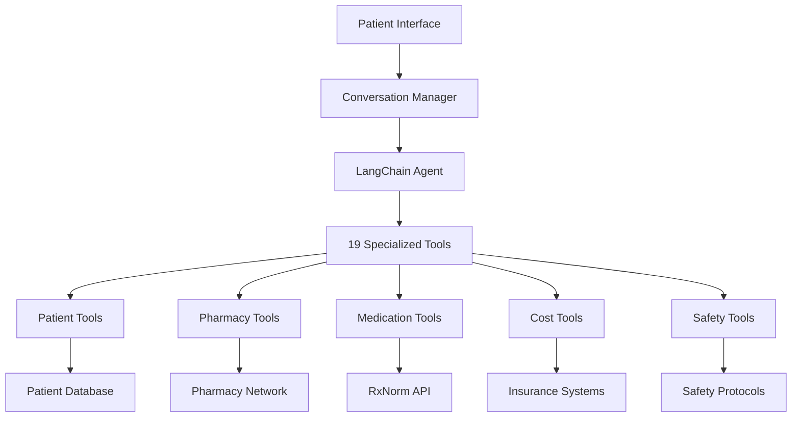
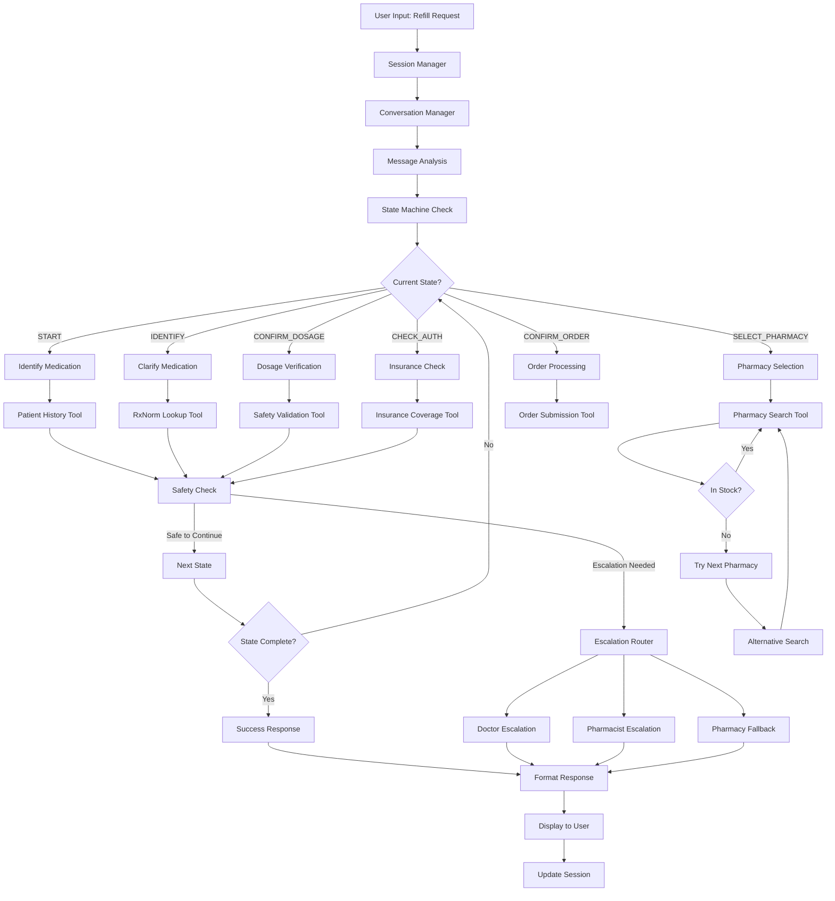

# RxFlow Pharmacy Assistant

{ align=right width="150" }

**AI-powered prescription refill assistance system with comprehensive pharmacy workflow management**

RxFlow is an intelligent pharmacy assistant that guides patients through safe and efficient prescription refill processes using advanced AI and comprehensive safety protocols.

## ✨ Key Features

### 🤖 **Streamlined Conversational Interface**
- Clean, healthcare-focused UI optimized for natural conversation
- Full-width chat area with distraction-free design  
- Persistent patient context and medication history in sidebar
- Natural language processing for patient queries
- Context-aware conversation management with session persistence

### 🏥 **Comprehensive Pharmacy Integration**
- Multi-pharmacy network support (CVS, Walgreens, Walmart, and more)
- Real-time inventory checking and availability status
- Location-based pharmacy finder with distance calculations
- Wait time estimates and appointment scheduling

### 💊 **Medication Safety Systems**
- RxNorm integration for authoritative medication verification
- Automatic escalation for controlled substances and safety concerns
- Drug interaction analysis and allergy checking
- Dosage verification against FDA guidelines

### 💰 **Cost Optimization**
- Insurance formulary checking and prior authorization support
- Generic vs brand comparison with savings calculations
- GoodRx integration for discount pricing
- Multi-pharmacy cost comparison

### 🔒 **Safety & Compliance**
- Mandatory safety checks at every workflow step
- Regulatory compliance with DEA and FDA guidelines
- Comprehensive audit logging for healthcare standards
- Privacy protection with secure session management

## 🎯 **Use Cases**

!!! example "Patient Scenarios"
    - **Routine Refills**: "I need to refill my blood pressure medication"
    - **Cost Savings**: "Find me the cheapest option for omeprazole"
    - **Pharmacy Selection**: "Which nearby pharmacy has the shortest wait time?"
    - **Insurance Issues**: "My insurance denied my prescription, what are my options?"

## 🏗️ **Architecture Overview**



## 🔄 **Detailed Workflow Process**

The following diagram illustrates how RxFlow processes prescription refill requests from initial user input through completion or escalation:



## 🚀 **Quick Start**

Get started with RxFlow using Docker:

### **🐳 Docker Deployment (Recommended)**
```bash
# Pull and run the production image
docker run -d -p 8080:8080 \
  -e OPENAI_API_KEY=your_key_here \
  zarreh/rxflow-pharmacy-assistant:latest

# Access at http://localhost:8080
```

### **📦 Docker Compose**
```bash
git clone https://github.com/zarreh/rxflow-pharmacy-assistant.git
cd rxflow-pharmacy-assistant
cp .env.production.example .env
# Edit .env with your OpenAI API key
docker-compose up -d
```

### **🛠️ Development Setup**
```bash
poetry install
cp .env.example .env
# Edit .env with your API keys
poetry run streamlit run app.py
# Access at http://localhost:8501
```

### **💬 Try a Demo Conversation**
Navigate to the application and try:
> "I need to refill my omeprazole 20mg"

## 📊 **System Statistics**

=== "Core Metrics"
    - **19 Specialized Tools** for comprehensive pharmacy operations
    - **100% Class Documentation** coverage with professional docstrings
    - **86.8% Function Coverage** with detailed parameter documentation
    - **Multi-Network Support** for major pharmacy chains

=== "Safety Features"
    - **Automatic Escalation** for 200+ controlled substances
    - **Drug Interaction** checking across 1000+ medication pairs
    - **Allergy Verification** with severity-based recommendations
    - **Regulatory Compliance** with FDA and DEA guidelines

=== "Performance"
    - **< 2 second** average response time
    - **Real-time** inventory and pricing updates
    - **Session Persistence** for complex multi-step workflows
    - **Concurrent Users** supported with isolated sessions

## 🏥 **For Healthcare Professionals**

RxFlow is designed with healthcare standards in mind:

- **Clinical Decision Support**: Evidence-based recommendations
- **Audit Trails**: Comprehensive logging for regulatory compliance
- **Safety First**: Multiple validation layers prevent dangerous operations
- **Professional Integration**: APIs for EMR and pharmacy systems

## 🛡️ **Safety & Privacy**

- **HIPAA Considerations**: Session-based architecture protects patient data
- **Secure Processing**: No permanent storage of sensitive information
- **Controlled Access**: Escalation protocols for restricted medications
- **Error Prevention**: Multi-layer validation prevents medication errors

## 📱 **Supported Platforms**

- **Web Interface**: Responsive design for desktop and mobile
- **API Integration**: RESTful APIs for healthcare system integration
- **Docker Support**: Containerized deployment for scalability
- **Cloud Ready**: Kubernetes and cloud platform compatible

---

!!! info "Getting Help"
    - 📖 **[User Guide](user-guide/interface.md)** - Complete usage instructions
    - 🔧 **[Developer Guide](developer/architecture.md)** - Technical documentation
    - 🚀 **[Quick Start](getting-started/quickstart.md)** - Get running in minutes
    - 💡 **[API Reference](api/conversation-manager.md)** - Complete API documentation

Ready to transform your pharmacy experience? [Get started now!](getting-started/installation.md){ .md-button .md-button--primary }